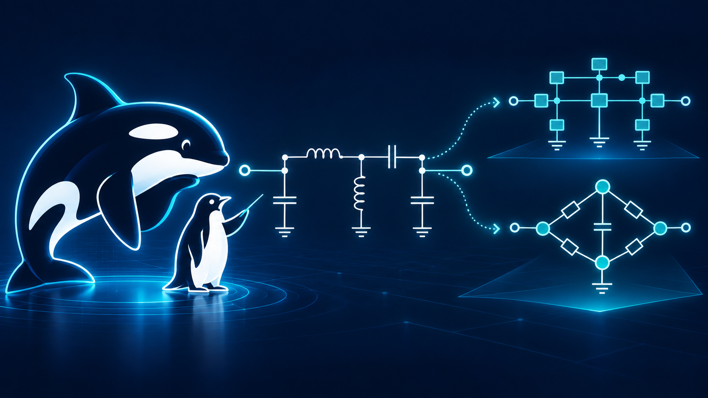

# SCNSim

**Build one physical circuit, choose the network you want to examine, and
optimize directly against the quantities that matter.**



SCNSim is a notebook-first Python package for reproducible superconducting
circuit-network analysis. You author components, physical values, wiring,
ground, Ports, and reusable Subsystems once. A sealed `CircuitPlan` preserves
those facts. A `CircuitRun` then asks typed Direct, harmonic-balance, sweep, or
Optimization questions through explicit Views and returns Results carrying
their request and evidence identities.

The current research showcase is `1.0.0.dev7`. Its new presentation and
showcase scope is `CONVERGING`: it is usable research software, not a stable
release or a claim of Human acceptance.

## Quantities first, grids when you need them

A conventional response request materializes S, Y, or Z on an exact frequency
grid. SCNSim also exposes Direct quantities that do not require turning a
dense transmission trace into an external fit first: loaded root frequency
and linewidth, coupled poles, transfer zeros, and residue-normalized coupling.

```python
root = DiagonalRootSpec(
    coordinate=resonator_node,
    root_hint=6.0 * u.GHz,
)

response = run.solve(
    run.original,
    DirectSolveSpec(
        frequencies=[5.8, 6.0, 6.2] * u.GHz,
        traces=(SParameterTrace(
            id="transmission",
            input_port="signal_in",
            input_mode=(),
            output_port="signal_out",
            output_mode=(),
        ),),
    ),
)
loaded_root = run.evaluate(retained_view, root)
```

A visible dip, a fitted resonance, a loaded analytic root, and a
residue-normalized coupling are different definitions. Fitting remains useful
for measurements, black-box models, and model identification. It is not a
mandatory translation layer for every quantity objective.

## One Plan, explicit Views

Subsystems own reusable physical declarations and expose typed Pins,
Coordinates, and Parameters. Views do not replace that physical ownership.
They state which network derived from the same captured Plan answers a
particular question:

- Port-Termination Compensation (PTC) removes only the named compensable load
  stamps.
- A power-conjugate transform changes the selected coordinate basis.
- `retain(...)` selects a complete-complement boundary while environmental
  dynamics remain represented through reduction.

The diagram always depicts the physical Plan; a View is analysis lineage, not
a fictitious `SubsystemView` or a claim that retained coordinates are
unloaded.


The same capstone records separately labeled raw and PTC-selected Direct S21
Results at three declared samples:

| Physical Plan | Raw loaded View | PTC-selected retained View |
|---|---|---|
| [certified schematic](examples/engineer/figures/04-explicit-capstone.svg) | [S21 figure](examples/engineer/figures/04-raw-direct-s21.svg) · [exact samples](examples/engineer/figures/04-raw-direct-s21.csv) | [S21 figure](examples/engineer/figures/04-ptc-direct-s21.svg) · [exact samples](examples/engineer/figures/04-ptc-direct-s21.csv) |

These assets retain their original source labels and identities; this README
does not rerun them.

## Optimize one candidate across several Views

An `OptimizationSpec` binds physical Parameters once while each scalar leaf
names its own View. Leaves that request the same root dependency share that
evaluation; leaves on a distinct PTC or transformed View remain distinct. The
saved best ordinal is selected from the verified ledger, including the
baseline when ordinal 0 remains best.

```python
frequency = root.frequency.on(raw_view)
linewidth = root.linewidth.on(raw_view)
ptc_frequency = root.frequency.on(ptc_view)

spec = OptimizationSpec(
    variables=(OptimizationVariable(
        parameter=capacitance,
        bounds=(100 * u.fF, 120 * u.fF),
        transform="log",
    ),),
    objectives=(
        CostObjective(
            id="raw_frequency",
            quantity=frequency,
            target=6.2 * u.GHz,
            weight=1 * u.dimensionless,
        ),
        CostObjective(
            id="minimum_view_separation",
            quantity=abs(frequency - ptc_frequency),
            comparison="at_least",
            target=1 * u.MHz,
            scale=1 * u.MHz,
            weight=1 * u.dimensionless,
        ),
        CostObjective(
            id="raw_linewidth",
            quantity=linewidth,
            target=1 * u.MHz,
            weight=1 * u.dimensionless,
        ),
    ),
    optimizer=CMAESSpec(seed=17, population_size=2, max_evaluations=3),
)

result = run.optimize(raw_view, spec)
result.plot(kind="comparison")
```

The `at_least` term contributes a soft one-sided penalty below its target.
Expression grouping is preserved. A lower total cost can improve the chosen
tradeoff while one component becomes worse; it does not guarantee that every
objective improves, that a target is attained, or that a global optimum was
found.

The code above is illustrative. The tables below are a read-only document
summary from one historical stored request, its sealed baseline checkpoint,
generation ledger, and saved Result. That request used two objectives rather
than the three shown above; it ran under optimization protocol v7 with
source-bound Python and Julia runtime identities.

| Historical setting | Expression or search setting | Target / comparison | Scale | Weight |
|---|---|---:|---:|---:|
| Capacitance | log bounds 100–120 fF | — | — | — |
| Raw root frequency | raw retained View | 6.2 GHz / target | 6.2 GHz | 1 |
| Root-frequency separation | abs(raw − PTC retained View) | 100 MHz / at least | 100 MHz | 1 |
| Optimizer | seed 17; population 2; maximum 3 evaluations; initial sigma 0.25 | — | — | — |

| Historical comparison | Initial | Best-found |
|---|---:|---:|
| Capacitance | 110 fF | 110 fF |
| Evaluation ordinal | 0 | 0 |
| Raw root frequency | 6.13588 GHz | 6.13588 GHz |
| Raw normalized residual | −0.0103425 | −0.0103425 |
| Raw weighted cost | 0.000106968 | 0.000106968 |
| Root-frequency separation | 0.0276500 MHz | 0.0276500 MHz |
| Separation normalized residual | 0.999723 | 0.999723 |
| Separation weighted cost | 0.999447 | 0.999447 |
| Total cost | 0.999554 | 0.999554 |

Ordinal 0 remained the Best-found point, so neither objective improved or
worsened between the two columns. The at-least separation remained below its
target and dominated the stored total cost. This is not a target-attainment or
global-optimum claim. No genuine corrected `Result.plot` visualization is
available for this historical record, and no substitute was fabricated.

## Reliability and comparison boundaries

The public Direct operator follows the documented convention

$$
D(\omega)=K-\omega^2C-i\omega G, \qquad
Y_{\mathrm{circ}}(\omega)=\frac{D(\omega)}{-i\omega}.
$$

Port-node incidence, declared loads, and the selected View form
$Y_{\mathrm{net}}$. Scattering then satisfies

$$
\left(I+\sqrt{R}\,Y_{\mathrm{net}}\sqrt{R}\right)S
=I-\sqrt{R}\,Y_{\mathrm{net}}\sqrt{R}.
$$

A loaded-root operator is therefore not the public Y matrix, and a
retained/reduced network is not generally a submatrix of S.

Direct and harmonic-balance Results share the physical Plan, Port convention,
and wave normalization. They are comparable only when the selected boundary,
channel, work point, pump-off state, and linearization agree. Chapter 4's
Direct and pump-off HB examples use independently declared grids, so they show
independent responses—not pointwise complex-S agreement or an independent
backend proof.

See the [Direct/HB realization concept](docs/concepts/direct-and-hb-realizations.qmd),
the [View concept](docs/concepts/compilation-coordinates-and-network-views.qmd),
and the [public Contract](docs/contracts/index.qmd) for the exact definitions
and failure boundaries.

## Reproducibility and ownership

- Specs are immutable declarations; Runs own execution and workspaces; typed
  Results own verified answers.
- Plan, request, source, attempt, artifact, and Result identities are checked
  before retained evidence is reused.
- Presentation reads verified Results and has no solver callback.
- The diagram path independently projects and audits the authored Plan; it
  does not choose an analysis View or establish numerical correctness.

SCNSim owns the circuit-network layer. Physical layout and electromagnetic
simulation remain SCGSim responsibilities. The implementation does not claim
universal speed or accuracy, automatic global root search, independent model
validation, or release readiness.

## Install and learn

```bash
git clone https://github.com/OrPenStrike/scnsim.git
cd scnsim
uv sync --locked
uv run python -c "import scnsim; print(scnsim.__version__)"
```

The Engineer-course generators use repository-local Jupyter tooling and an
optional static-export extra:

```bash
uv sync --locked --group course-generation --extra static-export
```

Start with the [Engineer course](docs/index.qmd). Chapters 1–4 form the
mainline path from a grounded LC through named two-Port S21 and the four-Port
capstone. Chapters 5–8 continue through reusable Libraries, diagram
composition, multi-conductor networks, and restart-safe report/resolve.

For a consuming repository, pin one reviewed SCNSim commit in that
repository's `pyproject.toml` and lockfile:

```bash
uv add "scnsim @ git+https://github.com/OrPenStrike/scnsim.git@<reviewed-commit-sha>"
```

## Current limits and status

The agreed multi-View Direct Optimization scope is implemented and usable,
including per-View lineage, dependency sharing, durable checkpoint reuse, and
typed Result presentation. The dev7 README and presentation refinements remain
`CONVERGING`; they do not reopen accepted Direct/HB algorithms or imply a
stable release. Historical whole-suite fixtures, broader multi-generation and
all-platform coverage, external publication, and consumer migrations are
separate work.

See the centralized [implementation and evidence status](docs/contracts/index.qmd#implementation-evidence-status)
for the exact validation boundary.

## License

SCNSim is licensed under the [Apache License 2.0](LICENSE). See
[NOTICE](NOTICE) for attribution and the separate JosephsonCircuits.jl backend
boundary.
