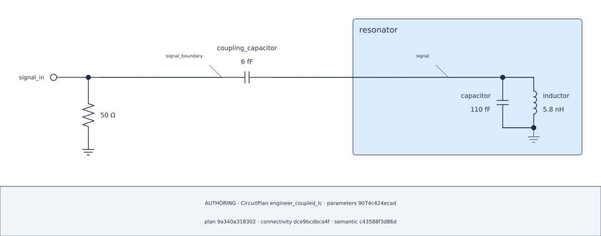
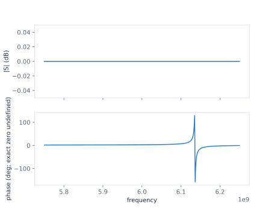
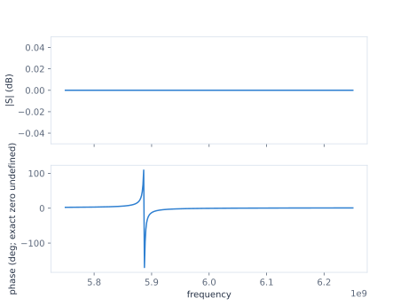

# SCNSim

**Author one superconducting circuit, then ask typed network and quantity
questions against it.**

[](https://github.com/OrPenStrike/scnsim/actions/workflows/ci.yml?query=branch%3Adevelop)
[](LICENSE)
[](pyproject.toml)
[](docs/index.qmd)


SCNSim is a notebook-first Python package for reproducible superconducting
circuit-network analysis. A `CircuitPlan` owns physical components, wiring,
ground, Ports, and reusable Subsystems; a `CircuitRun` solves explicit
requests and returns typed Results with request and evidence identities.

The current research showcase is `1.0.0.dev7`. This README and the site theme
are a `CONVERGING` documentation candidate, not a stable-release or scientific
validation claim.

## A first Direct S11 result

This Chapter 1 example builds a grounded parallel LC resonator, couples it to
one terminated 50 Ω measurement Port, and requests a named reflection trace.
The physical model and 110 fF / 120 fF values follow the Engineer course.

```python
import numpy as np

from scnsim import (
    CircuitPlan,
    CircuitRun,
    DirectSolveSpec,
    ParameterDefinitions,
    ParameterSet,
    ParameterSpec,
    SParameterTrace,
    components,
    units as u,
)

inputs = ParameterDefinitions(id="readme_lc")
capacitance = inputs.parameter(
    id="capacitance",
    baseline=110.0 * u.fF,
    spec=ParameterSpec(unit=u.fF),
)

plan = CircuitPlan(id="readme_coupled_lc")
resonator = plan.subsystem(id="resonator")
capacitor = resonator.add(
    components.capacitor(id="capacitor", capacitance=capacitance)
)
inductor = resonator.add(
    components.inductor(id="inductor", inductance=5.8 * u.nH)
)
resonator_bus = resonator.bus(id="signal")
resonator.parallel(
    id="parallel_lc",
    start=resonator_bus,
    branches=((capacitor,), (inductor,)),
    end=resonator.ground,
)
resonator_pin = resonator.expose_pin(id="terminal", at=resonator_bus)

signal_bus = plan.bus(id="signal_boundary")
coupling = plan.add(
    components.capacitor(id="coupling_capacitor", capacitance=6.0 * u.fF)
)
plan.series(
    id="coupling", start=signal_bus, elements=(coupling,), end=resonator_pin
)
plan.add_port(
    id="signal_in",
    at=signal_bus,
    role="terminated",
    reference_impedance=50.0 * u.ohm,
)

run = CircuitRun(plan=plan, workspace="workspaces/readme_lc")
reflection = SParameterTrace(
    id="reflection",
    input_port="signal_in",
    input_mode=(),
    output_port="signal_in",
    output_mode=(),
)
direct_spec = DirectSolveSpec(
    frequencies=np.linspace(5.75, 6.25, 401) * u.GHz,
    traces=(reflection,),
)
baseline = run.solve(run.original, direct_spec, parameters=ParameterSet())
selected = run.solve(
    run.original,
    direct_spec,
    parameters=ParameterSet({capacitance: 120.0 * u.fF}),
)
baseline_s11 = baseline.traces["reflection"]
selected_s11 = selected.traces["reflection"]
baseline_s11.show(component="magnitude", magnitude="db")
selected_s11.show(component="magnitude", magnitude="db")
```

The first `run.solve()` may prepare the locked Julia runtime. These are
previously published Chapter 1 figures—not generated during this README or the
website build—and show the same model, sample grid, and `signal_in ← signal_in`
channel. The figures present the complete S11 magnitude and phase; the named
`reflection` trace above is a typed projection of that Direct result.



*Authoring projection of the physical Plan; it is not a numerical result.*



*Stored Chapter 1 baseline Result: 110 fF. The magnitude axis uses a fixed ±0.05 dB display range; the wrapped phase discontinuity is presentation, not solver failure. [Exact complex samples](examples/engineer/figures/01-s11-data.csv).*



*Stored Chapter 1 selected Result: 120 fF, with the same 5.8 nH inductor, 6 fF coupler, 50 Ω Port, and 401-point grid. No dip or resonance is inferred from this plot. [Exact complex samples](examples/engineer/figures/01-s11-data.csv).*

Continue with the [Tutorial — Engineer course](docs/index.qmd).

## What the model can answer

- **Direct responses:** full finite-grid S, Y, and Z matrices, with named
  channel traces projected from the same Result.
- **Direct quantities:** loaded roots, coupled poles, transfer zeros, and
  residue-normalized couplings without requiring a fitted external model.
- **Views and Optimization:** Views select a derived analysis network without
  changing physical ownership. Optimization binds declared parameters and
  compares typed scalar objectives; a lower cost does not guarantee every
  target, improvement, or a global optimum.
- **Harmonic balance:** explicit pump, drive, operating-point, and response
  requests return their own typed outcomes. Direct and HB traces are comparable
  only when their selected boundary, channel, work point, pump state, and
  linearization agree.

These are research-model results, not universal accuracy or performance
guarantees. Fitting remains useful for measurements and model identification;
SCNSim does not claim automatic global root search or independent model
validation. Physical layout and electromagnetic simulation are SCGSim
responsibilities.

## Install and learn

```bash
git clone https://github.com/OrPenStrike/scnsim.git
cd scnsim
uv sync --locked
uv run python -c "import scnsim; print(scnsim.__version__)"
```

The site uses native Quarto HTML with the vendored, unmodified QDK v0.2.1
light/dark theme. To build it, use Quarto 1.10.18 or later and run
`quarto render --no-execute --no-clean`. Start with the
[Engineer course](docs/index.qmd); its aggregate Chapter notebooks are the
execution units, while the web lessons are reading pages. For a consuming
repository, pin one reviewed SCNSim commit in its `pyproject.toml` and lockfile:

```bash
uv add "scnsim @ git+https://github.com/OrPenStrike/scnsim.git@<reviewed-commit-sha>"
```

## License

Apache-2.0; see [LICENSE](LICENSE) and [NOTICE](NOTICE).
