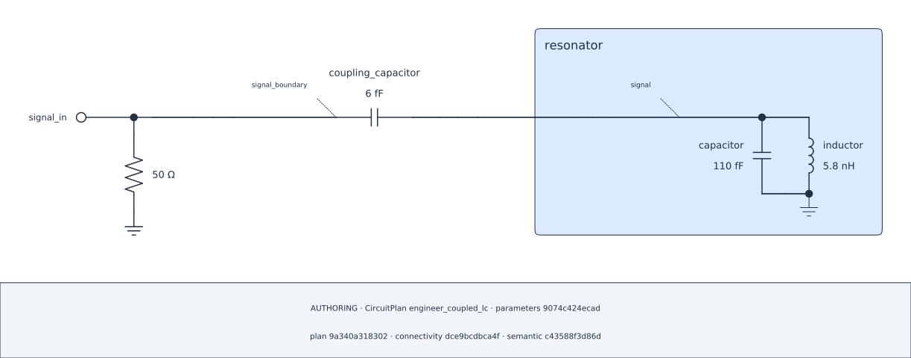

## Lesson 2 — Review the authored circuit {#lesson-diagram}

**Prerequisite:** run all Lesson 1 cells in the aggregate Chapter Notebook.

The authoring diagram is a projection of the Plan just declared. It does not
select a numerical View or execute a solver.

```{python}
#| id: ch1-render-authoring-diagram
diagram = plan.render_schematic(
    CircuitDiagramSpec(
        representation="authoring",
        theme=Theme.AUTO,
        show_parameter_values=True,
        show_provenance=True,
    )
)
```

```{python}
#| id: ch1-show-authoring-diagram
diagram.show()
```

::: {.content-visible when-format="html"}

{#fig-engineer-ch1-authoring .lightbox fig-alt="A terminated Port and six femtofarad series coupling capacitor connected directly to the public terminal of a grounded parallel 110 femtofarad and 5.8 nanohenry resonator."}

[Open the authoring SVG](../figures/01-authoring.svg).

:::

The independent audit checks whether visible connectivity and containment agree
with the captured Plan while retaining invisible source declarations as source
evidence.

```{python}
#| id: ch1-show-authoring-audit
diagram.audit.show()
```
