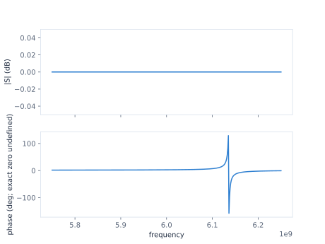

## Lesson 3 — Read the one-port S11 response {#lesson-s11}

**Prerequisite:** run Lessons 1–2 in the aggregate Chapter Notebook.

`CircuitRun` seals this Plan for analysis and owns its evidence workspace. The
frequency grid is an explicit 401-point request from 5.75 GHz through 6.25 GHz.

```{python}
#| id: ch1-prepare-direct-request
frequencies = np.linspace(5.75, 6.25, 401) * u.GHz
run = CircuitRun(
    plan=plan,
    workspace="workspaces/engineer-chapter-01",
)
direct_spec = DirectSolveSpec(frequencies=frequencies)
```

```{python}
#| id: ch1-solve-baseline-s11
baseline_response = run.solve(
    run.original,
    direct_spec,
    parameters=ParameterSet(),
)
```

The public presentation shows both magnitude and phase from the returned typed
Result. For this ideal lossless one-port model, `|S11|` is approximately 0 dB
across the grid; the phase still carries the readable response feature. A
magnitude dip is therefore not a resonance definition for this example. The
fixed ±0.05 dB display range keeps floating-point roundoff from being visually
autoscaled into a false feature; it does not round or change the response data.
The phase is shown as returned, including its ordinary wrapped-phase
discontinuity; that jump is angle presentation, not a numerical failure. The
horizontal values are Hz, and Matplotlib displays the `1e9` scale factor for
this GHz-range request.

```{python}
#| id: ch1-show-baseline-s11
baseline_s11_figure = baseline_response.s.show(magnitude="db")
baseline_s11_figure.axes[0].set_ylim(-0.05, 0.05)
baseline_s11_figure
```

::: {.content-visible when-format="html"}

{#fig-engineer-ch1-s11-baseline .lightbox fig-alt="Two-panel baseline S11 plot with magnitude near zero decibels and a varying phase across 5.75 to 6.25 gigahertz."}

[Open the baseline S11 SVG](../figures/01-s11-baseline.svg) ·
[download the complex response data](../figures/01-s11-data.csv).

:::
