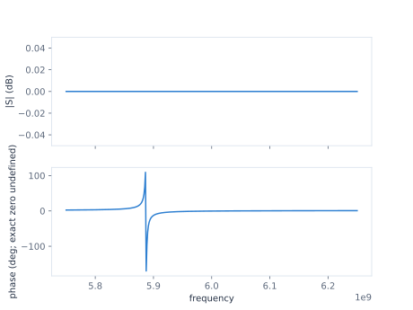

## Lesson 5 — Change capacitance on the same Plan {#lesson-change-capacitance}

**Prerequisite:** run Lessons 1–4 in the aggregate Chapter Notebook.

A `ParameterSet` selects 120 fF for the already-bound capacitor. It does not
mutate the Plan's 110 fF baseline or construct a second circuit.

```{python}
#| id: ch1-select-capacitance
selected_parameters = ParameterSet({capacitance: 120.0 * u.fF})
```

Use the same frequency grid, sealed Run, original View, and Direct request.

```{python}
#| id: ch1-solve-selected-s11
selected_response = run.solve(
    run.original,
    direct_spec,
    parameters=selected_parameters,
)
```

```{python}
#| id: ch1-show-selected-s11
selected_s11_figure = selected_response.s.plot(magnitude="db")
selected_s11_figure.update_yaxes(range=[-0.05, 0.05], row=1, col=1)
selected_s11_figure
```

::: {.content-visible when-format="html"}

{#fig-engineer-ch1-s11-selected .lightbox fig-alt="Two-panel selected-capacitance S11 plot with magnitude near zero decibels and a shifted phase feature across 5.75 to 6.25 gigahertz."}

[Open the selected S11 SVG](../figures/01-s11-selected.svg) ·
[download the complex response data](../figures/01-s11-data.csv).

:::

Evaluate the same loaded-root request at the selected point.

```{python}
#| id: ch1-evaluate-selected-root
selected_root = run.evaluate(
    root_view,
    root_spec,
    parameters=selected_parameters,
)
```

```{python}
#| id: ch1-show-selected-root
display(selected_root.frequency)
display(selected_root.linewidth)
selected_root.plot()
```

The generated quantity table reports both loaded Results beside the separate
unloaded LC calculation. It does not infer a dip from the nearly flat ideal
one-port magnitude.

::: {.content-visible when-format="html"}



[Download the baseline/selected quantity table](../figures/01-quantities.csv).

:::

Changing the selected physical capacitance shifts the phase feature and loaded
root without redefining the circuit. The Plan, request, parameter point, and
each Result retain separate identities.
