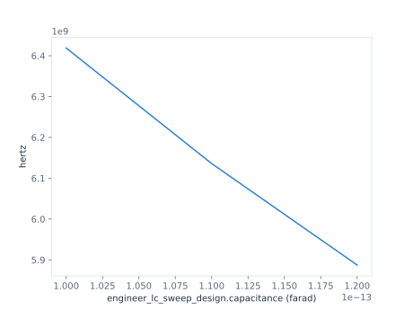

## Lesson 2 — Sweep capacitance {#lesson-ch2-sweep}

**Prerequisite:** run Lesson 1 in the aggregate Chapter Notebook.

Create one sealed Run and retain the child's published Coordinate. The 6 GHz
root hint selects the deterministic root basin; it is not a sweep bound or the
answer.

```{python}
#| id: ch2-prepare-root-request
run = CircuitRun(
    plan=plan,
    workspace="workspaces/engineer-chapter-02",
)
root_view = run.original.reduce(
    ReductionPipeline().retain(resonator_coordinate)
)
root_spec = DiagonalRootSpec(
    coordinate=resonator_coordinate,
    root_hint=6.0 * u.GHz,
)
```

This one-axis grid preserves the declared 100, 110, and 120 fF order. L is an
explicit fixed input at 5.8 nH, not a hidden second axis.

```{python}
#| id: ch2-define-capacitance-sweep
capacitance_space = ParameterSpace.grid(
    axes={
        capacitance: (
            100.0 * u.fF,
            110.0 * u.fF,
            120.0 * u.fF,
        ),
    },
    fixed=ParameterSet({inductance: 5.8 * u.nH}),
)
```

```{python}
#| id: ch2-run-capacitance-sweep
capacitance_sweep = run.evaluate(
    root_view,
    root_spec,
    parameters=capacitance_space,
)
```

Every point retains its complete effective `ParameterSet`, source index,
identity, and either a typed root Result or typed failure. Collection reads a
quantity already requested by `root_spec`; it launches no new calculation.

```{python}
#| id: ch2-show-capacitance-sweep
display(capacitance_sweep.show())
capacitance_frequency = capacitance_sweep.collect(
    quantity=root_spec.frequency
)
capacitance_sweep_figure = capacitance_frequency.show(x=capacitance)
capacitance_sweep_figure
```

::: {.content-visible when-format="html"}



{#fig-engineer-ch2-capacitance-sweep .lightbox fig-alt="A three-point curve of loaded root frequency against the declared 100, 110, and 120 femtofarad capacitance values at fixed 5.8 nanohenry inductance."}

[Open the sweep SVG](../figures/02-capacitance-sweep.svg) ·
[download the typed point data](../figures/02-capacitance-sweep.csv).

:::

This is the Chapter's core stopping point: one physical Plan, one fixed-L
capacitance space, and one typed Result per declared point. The next Lesson is
an optional tuning workflow, not a condition for understanding the sweep.
