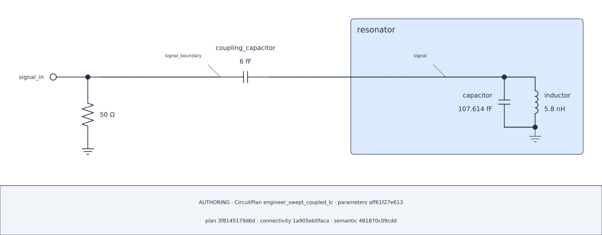

## Lesson 3 — Optimize and verify one winner {#lesson-ch2-optimize}

**Prerequisite:** run Lessons 1–2 in the aggregate Chapter Notebook.

::: {.callout-note title="This request may take several minutes" appearance="simple"}
The declared CMA-ES request evaluates real candidates with a fixed seed and
budget. Let it finish; the website never launches it.
:::

The optimization varies only C from 80 to 140 fF. L remains fixed at 5.8 nH,
the loaded-frequency target is 6.2 GHz, and the existing deterministic CMA-ES
controls remain `seed=17` and `max_evaluations=200`.

```{python}
#| id: ch2-define-optimization
optimization_spec = OptimizationSpec(
    variables=(
        OptimizationVariable(
            parameter=capacitance,
            bounds=(80.0 * u.fF, 140.0 * u.fF),
        ),
    ),
    objectives=(
        CostObjective(
            id="resonance_frequency",
            quantity=root_spec.frequency,
            target=6.2 * u.GHz,
            weight=1.0 * u.dimensionless,
        ),
    ),
    optimizer=CMAESSpec(seed=17, max_evaluations=200),
)
fixed_inductance = ParameterSet({inductance: 5.8 * u.nH})
```

```{python}
#| id: ch2-show-optimization-spec
optimization_spec.show()
```

The specification fixes the active input, bounds, objective, seed, and budget
before execution. It does not claim that any candidate meets a design target.

```{python}
#| id: ch2-run-optimization
optimization = run.optimize(
    root_view,
    optimization_spec,
    parameters=fixed_inductance,
)
best_parameters = optimization.best.parameters
display(best_parameters)
display(optimization.best.cost)
```

Use the returned winner in a separate root evaluation. This request neither
mutates the Plan's baselines nor infers a value from the optimizer's cost.

```{python}
#| id: ch2-evaluate-winner
winner_root = run.evaluate(
    root_view,
    root_spec,
    parameters=best_parameters,
)
display(winner_root.frequency)
display(winner_root.linewidth)
winner_root.plot()
```

Render that exact returned `ParameterSet` on the same Plan. The schematic is
authoring evidence at the selected point, not numerical proof of the objective.

```{python}
#| id: ch2-render-winner
winner_diagram = plan.render_schematic(
    CircuitDiagramSpec(),
    parameters=best_parameters,
)
```

```{python}
#| id: ch2-show-winner
winner_diagram.show()
winner_diagram.audit.show()
```

::: {.content-visible when-format="html"}



{#fig-engineer-ch2-winner .lightbox fig-alt="A terminated Port and fixed six femtofarad coupling capacitor connected directly to the public terminal of the grounded parallel resonator, labeled at the returned capacitance and fixed 5.8 nanohenry inductance."}

[Open the winner SVG](../figures/02-optimized-winner.svg) ·
[download the winner record](../figures/02-optimized-winner.csv).

:::
