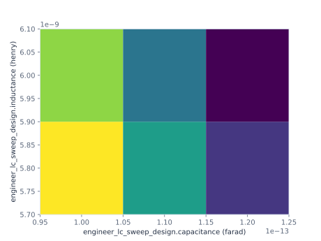

## Lesson 4 — Optional C/L spaces {#lesson-ch2-optional-spaces}

**Prerequisite:** run Lessons 1–3 in the aggregate Chapter Notebook.

This optional extension reuses the same Plan, Run, View, and root request. A
3 × 2 Cartesian grid evaluates every declared C/L combination. The listed
space evaluates only the two explicit pairs and does not become a grid.

```{python}
#| id: ch2-define-optional-spaces
capacitance_inductance_grid = ParameterSpace.grid(
    axes={
        capacitance: (
            100.0 * u.fF,
            110.0 * u.fF,
            120.0 * u.fF,
        ),
        inductance: (
            5.8 * u.nH,
            6.0 * u.nH,
        ),
    },
    fixed=ParameterSet(),
)
listed_pairs = ParameterSpace.points(
    (
        ParameterSet({
            capacitance: 100.0 * u.fF,
            inductance: 5.8 * u.nH,
        }),
        ParameterSet({
            capacitance: 120.0 * u.fF,
            inductance: 6.0 * u.nH,
        }),
    )
)
```

```{python}
#| id: ch2-run-optional-grid
optional_grid_sweep = run.evaluate(
    root_view,
    root_spec,
    parameters=capacitance_inductance_grid,
)
```

```{python}
#| id: ch2-show-optional-grid
display(optional_grid_sweep.show())
optional_grid_frequency = optional_grid_sweep.collect(
    quantity=root_spec.frequency
)
optional_grid_figure = optional_grid_frequency.show(
    x=capacitance,
    y=inductance,
)
optional_grid_figure
```

```{python}
#| id: ch2-run-and-show-listed-points
listed_pair_sweep = run.evaluate(
    root_view,
    root_spec,
    parameters=listed_pairs,
)
listed_pair_sweep.show()
```

::: {.content-visible when-format="html"}



{#fig-engineer-ch2-optional-grid .lightbox fig-alt="A six-cell heatmap of loaded root frequency for three capacitances and two inductances; the separate two listed pairs remain tabular rather than being interpolated."}

[Open the optional-grid SVG](../figures/02-optional-grid.svg) ·
[download the grid and listed-point records](../figures/02-optional-spaces.csv).

:::

The Cartesian and listed spaces retain different order and identity. Failed
points, if any, remain typed failures in their exact positions; they are never
silently replaced, interpolated, or reported as zero.
