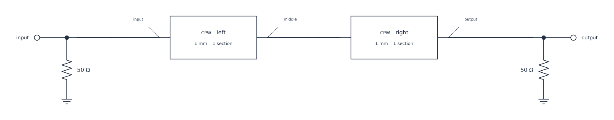
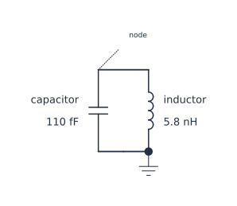

## Lesson 2 — Review what the fixed diagram can show {#lesson-ch3-diagram}

### Preserve the complete-Plan layout outcome

Rendering is independent of numerical execution. For this complete Plan, the
current fixed Default authoring layout reports a typed `schematic_layout`
failure. The cell catches only that stage so another validation error still
stops execution.

```{python}
#| id: ch3-attempt-complete-diagram
from scnsim.errors import SCNSimValidationError

complete_diagram = None
complete_diagram_error = None
try:
    complete_diagram = plan.render_schematic(
        CircuitDiagramSpec(
            representation="authoring",
            theme=Theme.AUTO,
            show_parameter_values=True,
            show_provenance=True,
        )
    )
except SCNSimValidationError as error:
    if error.stage != "schematic_layout":
        raise
    complete_diagram_error = error
    display(
        {
            "complete fixed layout unavailable": str(error),
            "stage": error.stage,
            "evidence": dict(error.evidence),
        }
    )
if complete_diagram is not None:
    display(complete_diagram.show())
```

::: {.callout-note title="Current complete-Plan layout limitation"}
The exact complete declaration currently reports `fixed connector intersects
occupied geometry`. Chapter 3 publishes no complete-Plan SVG certificate and
does not retry, search for another placement, or alter the circuit to obtain a
drawing.
:::

### Use honest standalone illustrations

`SubsystemPlan` is not independently renderable. The next two Plans are
therefore explicitly separate illustrations with distinct Plan identities.
They repeat the canonical physical values for the feedline and readout pieces,
but they are not projections, substitutes, or numerical fallbacks for the main
Plan.

```{python}
#| id: ch3-build-feedline-illustration
feedline_figure_plan = CircuitPlan(id="ch3_feedline_subcircuit_illustration")
figure_cpw = RLGC(
    conductors=("signal",),
    reference_conductor="ground",
    resistance_per_length=[[0.0]] * u.ohm / u.m,
    inductance_per_length=[[420.0]] * u.nH / u.m,
    conductance_per_length=[[0.0]] * u.S / u.m,
    capacitance_per_length=[[175.0]] * u.pF / u.m,
)
figure_left = feedline_figure_plan.add(
    components.transmission_line(
        id="left", length=1.0 * u.mm, rlgc=figure_cpw, n_sections=1
    )
)
figure_right = feedline_figure_plan.add(
    components.transmission_line(
        id="right", length=1.0 * u.mm, rlgc=figure_cpw, n_sections=1
    )
)
figure_input = feedline_figure_plan.bus(id="input")
figure_middle = feedline_figure_plan.bus(id="middle")
figure_output = feedline_figure_plan.bus(id="output")
feedline_figure_plan.series(
    id="left_section",
    start=figure_input,
    elements=(
        figure_left.between(
            figure_left.pin("head", conductor="signal"),
            figure_left.pin("tail", conductor="signal"),
        ),
    ),
    end=figure_middle,
)
feedline_figure_plan.series(
    id="right_section",
    start=figure_middle,
    elements=(
        figure_right.between(
            figure_right.pin("head", conductor="signal"),
            figure_right.pin("tail", conductor="signal"),
        ),
    ),
    end=figure_output,
)
feedline_figure_plan.add_port(
    id="input",
    at=figure_input,
    role="terminated",
    reference_impedance=50.0 * u.ohm,
)
feedline_figure_plan.add_port(
    id="output",
    at=figure_output,
    role="terminated",
    reference_impedance=50.0 * u.ohm,
)
feedline_illustration = feedline_figure_plan.render_schematic(
    CircuitDiagramSpec(
        representation="authoring",
        theme=Theme.AUTO,
        show_parameter_values=True,
        show_provenance=False,
    )
)
feedline_illustration.show()
```

::: {.content-visible when-format="html"}

{#fig-ch3-feedline-illustration .lightbox fig-alt="Separate illustrative Plan with two one-millimetre scalar CPW sections between terminated Ports."}

[Open the SVG](../figures/03-feedline-illustration.svg).

:::

```{python}
#| id: ch3-build-readout-illustration
readout_figure_plan = CircuitPlan(id="ch3_readout_subcircuit_illustration")
figure_readout_capacitor = readout_figure_plan.add(
    components.capacitor(id="capacitor", capacitance=110.0 * u.fF)
)
figure_readout_inductor = readout_figure_plan.add(
    components.inductor(id="inductor", inductance=5.8 * u.nH)
)
figure_readout_bus = readout_figure_plan.bus(id="node")
readout_figure_plan.parallel(
    id="parallel_lc",
    start=figure_readout_bus,
    branches=((figure_readout_capacitor,), (figure_readout_inductor,)),
    end=readout_figure_plan.ground,
)
readout_illustration = readout_figure_plan.render_schematic(
    CircuitDiagramSpec(
        representation="authoring",
        theme=Theme.AUTO,
        show_parameter_values=True,
        show_provenance=False,
    )
)
readout_illustration.show()
```

::: {.content-visible when-format="html"}

{#fig-ch3-readout-illustration .lightbox fig-alt="Separate illustrative Plan containing a 110 femtofarad capacitor and 5.8 nanohenry inductor in parallel to ground."}

[Open the SVG](../figures/03-readout-illustration.svg).

:::

The following is only a topology reading aid; it is not a rendered circuit,
electrical evidence, or an ASCDLS certificate:

```text
feedline_in -- [1 mm CPW] -- tap -- [1 mm CPW] -- feedline_out
                               |
                              6 fF
                               |
                       110 fF || 5.8 nH
                               |
                             ground
```
