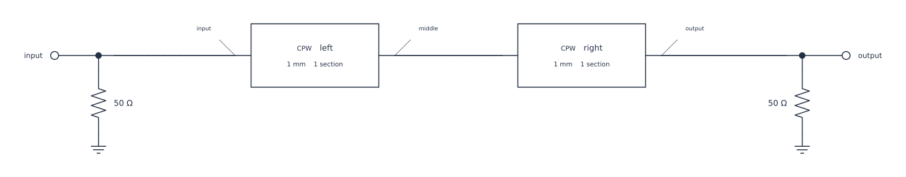
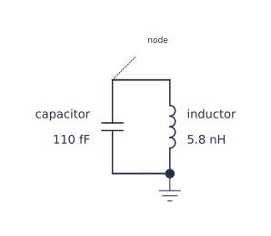

## Lesson 2 — Review what the fixed diagram can show {#lesson-ch3-diagram}

Current source cells use full explicit layouts bound to fresh preparation. Stored figures and Notebook outputs retain their original execution identities; this source-only update does not regenerate them.

### Preserve the complete-Plan layout outcome

Rendering is independent of numerical execution. Prepare this exact Plan,
then declare its complete root and child geometry in ordinary Python. The
package renderer checks those declarations and independently audits the ink;
it does not finish a partial recipe or retry a failed layout.

```{python}
#| id: ch3-attempt-complete-diagram
from examples.engineer.diagram_layouts import engineer_layout
from scnsim.errors import SCNSimValidationError

complete_preparation = plan.prepare_schematic(
    CircuitDiagramSpec(
        representation="authoring", theme=Theme.AUTO,
        show_parameter_values=True, show_provenance=True,
    )
)
complete_layout = engineer_layout(complete_preparation, "feedline_readout")
complete_diagram = plan.render_schematic(
    CircuitDiagramSpec(
        layout=complete_layout, representation="authoring", theme=Theme.AUTO,
        show_parameter_values=True, show_provenance=True,
    )
)
display(complete_diagram.show())
```

::: {.callout-note title="Historical complete-Plan observation"}
The stored earlier automatic-layout attempt reported `fixed connector intersects
occupied geometry`. Its original output remains historical; the explicit-layout
source below has not regenerated a complete-Plan certificate.
:::

### Use honest standalone illustrations

`SubsystemPlan` is not independently renderable. The next two Plans are
therefore explicitly separate illustrations with distinct Plan identities.
They repeat the canonical physical values for the feedline and readout pieces,
but they are not projections, substitutes, or numerical fallbacks for the main
Plan.

```{python}
#| id: ch3-build-feedline-illustration
feedline_figure_plan = CircuitPlan(id="ch3_feedline_subcircuit_illustration")
figure_cpw = RLGC(
    conductors=("signal",),
    reference_conductor="ground",
    resistance_per_length=[[0.0]] * u.ohm / u.m,
    inductance_per_length=[[420.0]] * u.nH / u.m,
    conductance_per_length=[[0.0]] * u.S / u.m,
    capacitance_per_length=[[175.0]] * u.pF / u.m,
)
figure_left = feedline_figure_plan.add(
    components.transmission_line(
        id="left", length=1.0 * u.mm, rlgc=figure_cpw, n_sections=1
    )
)
figure_right = feedline_figure_plan.add(
    components.transmission_line(
        id="right", length=1.0 * u.mm, rlgc=figure_cpw, n_sections=1
    )
)
figure_input = feedline_figure_plan.bus(id="input")
figure_middle = feedline_figure_plan.bus(id="middle")
figure_output = feedline_figure_plan.bus(id="output")
feedline_figure_plan.series(
    id="left_section",
    start=figure_input,
    elements=(
        figure_left.between(
            figure_left.pin("head", conductor="signal"),
            figure_left.pin("tail", conductor="signal"),
        ),
    ),
    end=figure_middle,
)
feedline_figure_plan.series(
    id="right_section",
    start=figure_middle,
    elements=(
        figure_right.between(
            figure_right.pin("head", conductor="signal"),
            figure_right.pin("tail", conductor="signal"),
        ),
    ),
    end=figure_output,
)
feedline_figure_plan.add_port(
    id="input",
    at=figure_input,
    role="terminated",
    reference_impedance=50.0 * u.ohm,
)
feedline_figure_plan.add_port(
    id="output",
    at=figure_output,
    role="terminated",
    reference_impedance=50.0 * u.ohm,
)
feedline_preparation = feedline_figure_plan.prepare_schematic(
    CircuitDiagramSpec(theme=Theme.AUTO, show_parameter_values=True, show_provenance=False)
)
feedline_layout = engineer_layout(feedline_preparation, "feedline_illustration")
feedline_illustration = feedline_figure_plan.render_schematic(
    CircuitDiagramSpec(layout=feedline_layout, theme=Theme.AUTO,
                       show_parameter_values=True, show_provenance=False)
)
display(feedline_illustration.show())
```

::: {.content-visible when-format="html"}

{#fig-ch3-feedline-illustration .lightbox fig-alt="Separate illustrative Plan with two one-millimetre scalar CPW sections between terminated Ports."}

[Open the SVG](../figures/03-feedline-illustration.svg).

:::

```{python}
#| id: ch3-build-readout-illustration
readout_figure_plan = CircuitPlan(id="ch3_readout_subcircuit_illustration")
figure_readout_capacitor = readout_figure_plan.add(
    components.capacitor(id="capacitor", capacitance=110.0 * u.fF)
)
figure_readout_inductor = readout_figure_plan.add(
    components.inductor(id="inductor", inductance=5.8 * u.nH)
)
figure_readout_bus = readout_figure_plan.bus(id="node")
readout_figure_plan.parallel(
    id="parallel_lc",
    start=figure_readout_bus,
    branches=((figure_readout_capacitor,), (figure_readout_inductor,)),
    end=readout_figure_plan.ground,
)
readout_preparation = readout_figure_plan.prepare_schematic(
    CircuitDiagramSpec(theme=Theme.AUTO, show_parameter_values=True, show_provenance=False)
)
readout_layout = engineer_layout(readout_preparation, "readout_illustration")
readout_illustration = readout_figure_plan.render_schematic(
    CircuitDiagramSpec(layout=readout_layout, theme=Theme.AUTO,
                       show_parameter_values=True, show_provenance=False)
)
display(readout_illustration.show())
```

::: {.content-visible when-format="html"}

{#fig-ch3-readout-illustration .lightbox fig-alt="Separate illustrative Plan containing a 110 femtofarad capacitor and 5.8 nanohenry inductor in parallel to ground."}

[Open the SVG](../figures/03-readout-illustration.svg).

:::

The following is only a topology reading aid; it is not a rendered circuit,
electrical evidence, or an ASCDLS certificate:

```text
feedline_in -- [1 mm CPW] -- tap -- [1 mm CPW] -- feedline_out
                               |
                              6 fF
                               |
                       110 fF || 5.8 nH
                               |
                             ground
```
