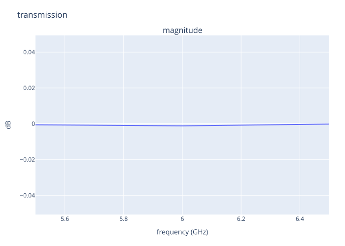

## Lesson 3 — Request the named two-Port S21 trace {#lesson-ch3-s21}

### Declare one finite sample grid and one channel

The selected network is `run.original`: the complete main Plan has exactly the
two terminated feedline Ports needed by this request. `transmission` names the
output-from-input projection of the complete Direct S matrix; it does not
launch a separate solve.

```{python}
#| id: ch3-prepare-direct-s21
run = CircuitRun(plan=plan, workspace="workspaces/engineer-chapter-03")
view = run.original
sample_frequencies = [5.5, 6.0, 6.5] * u.GHz
transmission_trace = SParameterTrace(
    id="transmission",
    input_port="feedline_in",
    input_mode=(),
    output_port="feedline_out",
    output_mode=(),
)
direct_spec = DirectSolveSpec(
    frequencies=sample_frequencies,
    traces=(transmission_trace,),
)
run.explain(view, direct_spec).show()
```

The grid contains exactly three declared samples. Lines drawn between them are
presentation only: this lesson does not infer a continuous resonance, locate a
dip, interpolate, or evaluate an undeclared frequency.

```{python}
#| id: ch3-solve-direct-s21
direct = run.solve(view, direct_spec)
transmission = direct.traces["transmission"]
```

`transmission.value` retains the complex dimensionless S21 values. The plot
below shows magnitude in dB, while the generated CSV preserves real and
imaginary parts at every declared frequency.

```{python}
#| id: ch3-show-direct-s21
display(direct.s.view)
display(transmission.frequencies)
display(transmission.value)
transmission.plot(component="magnitude", magnitude="db", theme=Theme.AUTO)
```

::: {.content-visible when-format="html"}

{#fig-ch3-direct-s21 .lightbox fig-alt="Three-sample magnitude plot for the named feedline-in to feedline-out Direct S21 trace."}



[Open the SVG](../figures/03-direct-s21.svg) ·
[Download the exact complex samples](../figures/03-direct-s21.csv)

:::

This numerical plot is a presentation of a verified Direct Result, not an
ASCDLS certificate. The two standalone schematics in Lesson 2 have their own
distinct illustrative Plan identities.
