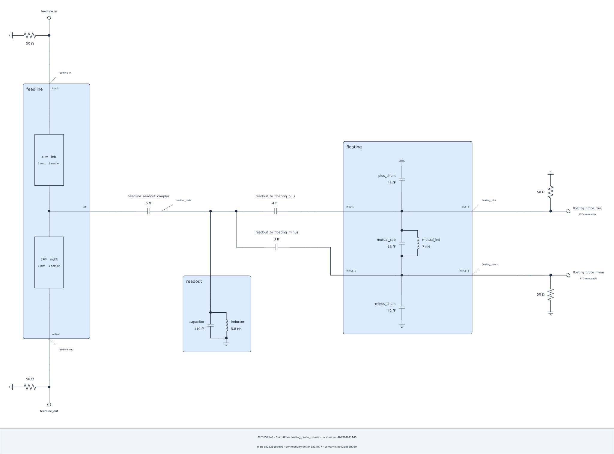

## Lesson 2 — Review the explicit physical composition {#lesson-ch4-capstone}

### Compose the existing Plan without changing it

The complete Default layout remains outside this lesson's success claim. This
is the established explicit probe-tee composition for the exact Plan above.
Its Ts, elbow, axes, sides, and local grounds are presentation choices, not
electrical nodes or an alternate model.

```{python}
#| id: ch4-configure-explicit-composition
from scnsim import DiagramAxis, DiagramSide, SchematicComposition

composition = SchematicComposition(plan=plan)
composition.axis(feedline, DiagramAxis.VERTICAL)
composition.axis(left_section, DiagramAxis.VERTICAL)
composition.axis(right_section, DiagramAxis.VERTICAL)
composition.order(plan, members=(feedline, readout, floating))

wiring = composition.replace_wiring(at=readout_terminal)
readout_t = wiring.tee(id="readout_attachment", branch=DiagramSide.BOTTOM)
split_t = wiring.tee(id="floating_split", branch=DiagramSide.BOTTOM)
lower_turn = wiring.elbow(
    id="floating_minus_turn",
    sides=(DiagramSide.TOP, DiagramSide.RIGHT),
)
wiring.connect(
    composition.endpoint(feedline_readout, boundary="end"),
    readout_t.left,
)
wiring.connect(readout_t.bottom, composition.endpoint(readout_terminal))
wiring.connect(readout_t.right, split_t.left)
wiring.connect(
    split_t.right,
    composition.endpoint(readout_floating_plus, boundary="start"),
)
wiring.connect(split_t.bottom, lower_turn.top)
wiring.connect(
    lower_turn.right,
    composition.endpoint(readout_floating_minus, boundary="start"),
)

composition.terminal_side(plus_1, DiagramSide.LEFT)
composition.terminal_side(minus_1, DiagramSide.LEFT)
composition.terminal_side(plus_2, DiagramSide.RIGHT)
composition.terminal_side(minus_2, DiagramSide.RIGHT)
composition.port_orientation(
    feedline_in_port,
    boundary_side=DiagramSide.TOP,
    load_side=DiagramSide.LEFT,
)
composition.port_orientation(
    feedline_out_port,
    boundary_side=DiagramSide.BOTTOM,
    load_side=DiagramSide.LEFT,
)
composition.port_orientation(
    probe_plus,
    boundary_side=DiagramSide.RIGHT,
    load_side=DiagramSide.TOP,
)
composition.port_orientation(
    probe_minus,
    boundary_side=DiagramSide.RIGHT,
    load_side=DiagramSide.BOTTOM,
)
composition.ground_side(plus_branch, DiagramSide.TOP)
composition.ground_side(minus_branch, DiagramSide.BOTTOM)

plus_wiring = composition.replace_wiring(at=floating_plus_bus)
plus_output = plus_wiring.straight(
    id="probe_attachment",
    axis=DiagramAxis.HORIZONTAL,
)
plus_wiring.connect(composition.endpoint(plus_2), plus_output.left)
plus_wiring.connect(plus_output.right, composition.endpoint(probe_plus))

minus_wiring = composition.replace_wiring(at=floating_minus_bus)
minus_output = minus_wiring.straight(
    id="probe_attachment",
    axis=DiagramAxis.HORIZONTAL,
)
minus_wiring.connect(composition.endpoint(minus_2), minus_output.left)
minus_wiring.connect(minus_output.right, composition.endpoint(probe_minus))
```

Every replaced group includes all its actual attachments. The equivalent
floating Pins share voltage through the child's real internal wiring; the
composition does not shortcut their distinct parent-local groups.

```{python}
#| id: ch4-render-explicit-capstone
capstone_diagram = plan.render_schematic(
    CircuitDiagramSpec(
        representation="authoring",
        theme=Theme.AUTO,
        show_parameter_values=True,
        show_provenance=True,
        layout=composition,
    )
)
capstone_diagram.show()
capstone_diagram.audit.show()
```

::: {.content-visible when-format="html"}

{#fig-ch4-explicit-capstone .lightbox fig-alt="Four-Port capstone with a two-section feedline, grounded readout, floating pair, three coupling capacitors, and separate right-side probe outputs."}

[Open the SVG](../figures/04-explicit-capstone.svg).

:::

The certificate binds the Plan and presentation. It does not claim that PTC or
any numerical request changed the drawing.
