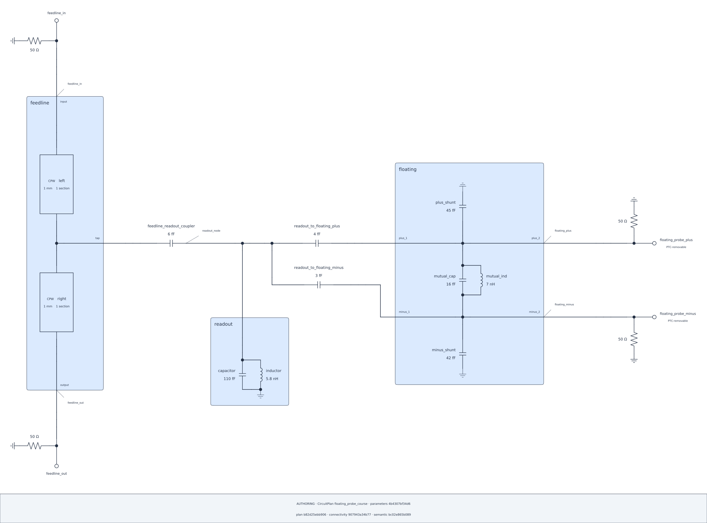

## Lesson 2 — Review the explicit physical composition {#lesson-ch4-capstone}

Current source cells use full explicit layouts bound to fresh preparation. Stored figures and Notebook outputs retain their original execution identities; this source-only update does not regenerate them.

### Compose the existing Plan without changing it

The course helper explicitly declares each physical occurrence and the full
feedline, readout and floating child scenes. Its Ts, cardinal turn, Ports and
local grounds are presentation choices; the original electrical Plan is
unchanged. No automatic completion chooses missing geometry.

```{python}
#| id: ch4-configure-explicit-composition
from examples.engineer.diagram_layouts import engineer_layout

capstone_preparation = plan.prepare_schematic(
    CircuitDiagramSpec(
        representation="authoring", theme=Theme.AUTO,
        show_parameter_values=True, show_provenance=True,
    )
)
# The recipe declares each body, each child scope and every actual route.
# readout_attachment/floating_split keep all three explicit T arms;
# floating_minus_turn retains its top/right cardinal turn.
capstone_layout = engineer_layout(capstone_preparation, "four_port_capstone")
```

Every declared group includes all its actual attachments. The equivalent
floating Pins share voltage through the child's real internal wiring; the
layout does not shortcut their distinct parent-local groups.

```{python}
#| id: ch4-render-explicit-capstone
capstone = plan.render_schematic(
    CircuitDiagramSpec(
        layout=capstone_layout, representation="authoring", theme=Theme.AUTO,
        show_parameter_values=True, show_provenance=True,
    )
)
capstone.show()
```

::: {.content-visible when-format="html"}

{#fig-ch4-explicit-capstone .lightbox fig-alt="Four-Port capstone with a two-section feedline, grounded readout, floating pair, three coupling capacitors, and separate right-side probe outputs."}

[Open the SVG](../figures/04-explicit-capstone.svg).

:::

The certificate binds the Plan and presentation. It does not claim that PTC or
any numerical request changed the drawing.
