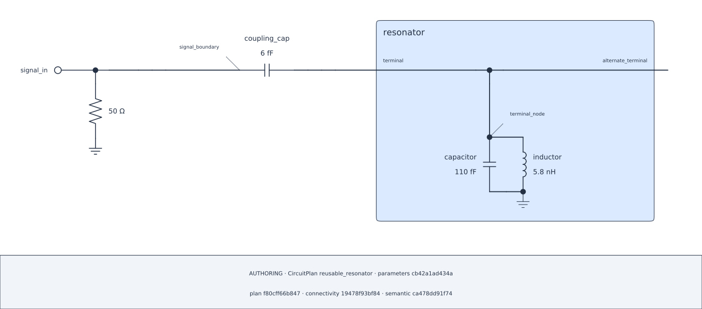

## Lesson 3 — Reuse the component from its boundary {#lesson-ch5-reuse}

### Couple the parent directly to the child Pin

The 6 fF coupler and terminated 50 ohm Port belong to the parent. The series
relation ends at the child's public Pin; the Coordinate does not require a
second parent Bus.

```{python}
#| id: ch5-connect-parent-boundary
signal_bus = plan.bus(id="signal_boundary")
coupler = plan.add(
    components.capacitor(id="coupling_cap", capacitance=6.0 * u.fF)
)
plan.series(
    id="coupling",
    start=signal_bus,
    elements=(coupler,),
    end=resonator_terminal,
)
signal_port = plan.add_port(
    id="signal_in",
    at=signal_bus,
    role="terminated",
    reference_impedance=50.0 * u.ohm,
)
```

### Review the authored parent/child boundary

```{python}
#| id: ch5-render-reused-composite
reused_diagram = plan.render_schematic(
    CircuitDiagramSpec(
        representation="authoring",
        theme=Theme.AUTO,
        show_parameter_values=True,
        show_provenance=True,
    )
)
reused_diagram.show()
```

::: {.content-visible when-format="html"}

{#fig-ch5-reusable-composite .lightbox fig-alt="Parent-owned coupling capacitor and terminated Port connected to the public terminal of a reusable grounded LC while an equivalent public Pin remains open."}

[Open the SVG](../figures/05-reusable-composite.svg)

:::

```{python}
#| id: ch5-show-reused-composite-audit
reused_diagram.audit.show()
```

The authoring certificate and audit describe the exact Plan boundary. They do
not publish private editable handles from the built Composite.
