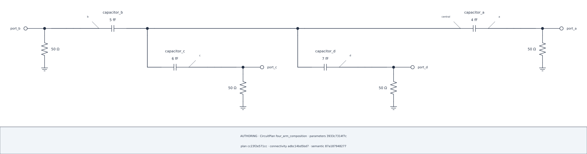

## Lesson 1 — Start from Default composition {#lesson-ch6-default}

### Declare one fixed four-arm Plan

Diagram composition changes presentation, never the circuit. This illustration
has one central Bus, four real capacitor arms, and four terminated 50 ohm Ports.

```{python}
#| id: ch6-build-four-arm-plan
from IPython.display import display

from scnsim import (
    CircuitDiagramSpec,
    CircuitPlan,
    DiagramAxis,
    DiagramSide,
    RLGC,
    SCNSimValidationError,
    SchematicComposition,
    Theme,
    components,
    units as u,
)

four_arm_plan = CircuitPlan(id="four_arm_composition")
central_bus = four_arm_plan.bus(id="central")
outer_buses = {
    name: four_arm_plan.bus(id=name) for name in ("a", "b", "c", "d")
}
capacitors = {
    name: four_arm_plan.add(
        components.capacitor(id=f"capacitor_{name}", capacitance=value * u.fF)
    )
    for name, value in zip(("a", "b", "c", "d"), (4.0, 5.0, 6.0, 7.0), strict=True)
}
arms = {
    name: four_arm_plan.series(
        id=f"arm_{name}",
        start=central_bus,
        elements=(capacitors[name],),
        end=outer_buses[name],
    )
    for name in ("a", "b", "c", "d")
}
ports = {
    name: four_arm_plan.add_port(
        id=f"port_{name}",
        at=outer_buses[name],
        role="terminated",
        reference_impedance=50.0 * u.ohm,
    )
    for name in ("a", "b", "c", "d")
}
```

The branch labels are identifiers, not a claim about signal flow. The central
Bus adds no fifth arm.

```{python}
#| id: ch6-render-default-composition
four_arm_composition = SchematicComposition.automatic(plan=four_arm_plan)
four_arm_default = four_arm_plan.render_schematic(
    CircuitDiagramSpec(layout=four_arm_composition, theme=Theme.AUTO)
)
four_arm_default.show()
```

::: {.content-visible when-format="html"}

{#fig-ch6-four-arm-default .lightbox fig-alt="Four capacitor arms and terminated Ports arranged by Default schematic composition."}

[Open the SVG](../figures/06-four-arm-default.svg)

:::

```{python}
#| id: ch6-show-default-audit
four_arm_default.audit.show()
```

The A/B audit reconstructs visible electrical and structural evidence. Passing
it does not make pixels authoritative or reveal hidden recipe metadata.
