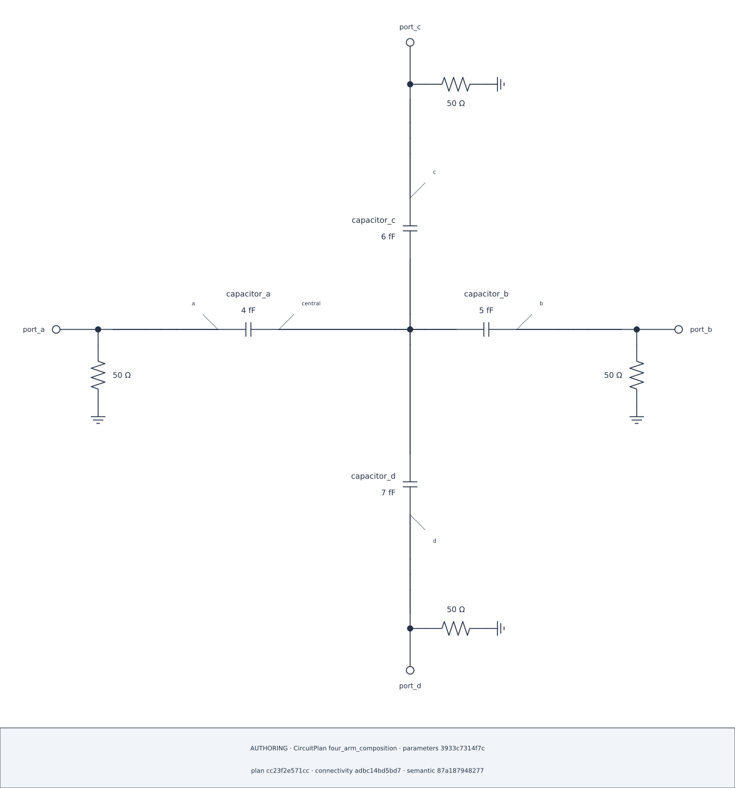

## Lesson 3 — Request actual T and Cross junctions {#lesson-ch6-junctions}

Current source cells use full explicit layouts bound to fresh preparation. Stored figures and Notebook outputs retain their original execution identities; this source-only update does not regenerate them.

### Build a three-contact tapped feedline

The T example reuses the established two-section scalar CPW declaration. Its
three contacts are the left-section end, right-section start, and exposed tap
Pin on one owner-local Bus.

```{python}
#| id: ch6-build-tapped-feedline
tapped_plan = CircuitPlan(id="tapped_feedline_t")
feedline = tapped_plan.subsystem(id="feedline")
cpw = RLGC(
    conductors=("signal",),
    reference_conductor="ground",
    resistance_per_length=[[0.0]] * u.ohm / u.m,
    inductance_per_length=[[420.0]] * u.nH / u.m,
    conductance_per_length=[[0.0]] * u.S / u.m,
    capacitance_per_length=[[175.0]] * u.pF / u.m,
)
left = feedline.add(
    components.transmission_line(
        id="left", length=1.0 * u.mm, rlgc=cpw, n_sections=1
    )
)
right = feedline.add(
    components.transmission_line(
        id="right", length=1.0 * u.mm, rlgc=cpw, n_sections=1
    )
)
input_bus = feedline.bus(id="input")
tap_bus = feedline.bus(id="tap")
output_bus = feedline.bus(id="output")
left_tap = tap_bus.tap(id="left_section")
right_tap = tap_bus.tap(id="right_section")
coupling_tap = tap_bus.tap(id="coupling")
left_section = feedline.series(
    id="left_section",
    start=input_bus,
    elements=(left.between(left.pin("head", conductor="signal"), left.pin("tail", conductor="signal")),),
    end=left_tap,
)
right_section = feedline.series(
    id="right_section",
    start=right_tap,
    elements=(right.between(right.pin("head", conductor="signal"), right.pin("tail", conductor="signal")),),
    end=output_bus,
)
feedline.expose_pin(id="input", at=input_bus)
feedline_tap_pin = feedline.expose_pin(id="tap", at=coupling_tap)
feedline.expose_pin(id="output", at=output_bus)
```

```{python}
#| id: ch6-request-and-render-t
tapped_preparation = tapped_plan.prepare_schematic(
    CircuitDiagramSpec(theme=Theme.AUTO)
)
tapped_layout = engineer_layout(tapped_preparation, "tapped_feedline")
tapped_t_diagram = tapped_plan.render_schematic(
    CircuitDiagramSpec(layout=tapped_layout, theme=Theme.AUTO)
)
display(tapped_t_diagram.show())
```

::: {.content-visible when-format="html"}



:::

The T is a non-element conductive presentation primitive. It creates no new
net, Tap, Coordinate, or permission to address private Composite contents.

### Inspect the explicitly declared Cross again

The four-arm recipe already declares `central_cross` with all four arms.
This call renders that same full layout again so its visible attachments and
independent audit can be inspected; it does not replace the junction geometry.

```{python}
#| id: ch6-request-cross
# The recipe already declares all four actual arms of central_cross.
four_arm_cross = four_arm_plan.render_schematic(
    CircuitDiagramSpec(layout=four_arm_layout, theme=Theme.AUTO)
)
four_arm_cross.show()
```

::: {.content-visible when-format="html"}

{#fig-ch6-four-arm-cross .lightbox fig-alt="Four capacitor arms attached to all four arms of one explicitly requested Cross."}

[Open the SVG](../figures/06-four-arm-cross.svg)

:::

```{python}
#| id: ch6-show-cross-audit
four_arm_cross.audit.show()
```

The existing layout requests one Cross rather than a pair of Ts. Electrical
connectivity alone does not establish that requested shape; its four actual
attachments and declared arms are each represented once.
