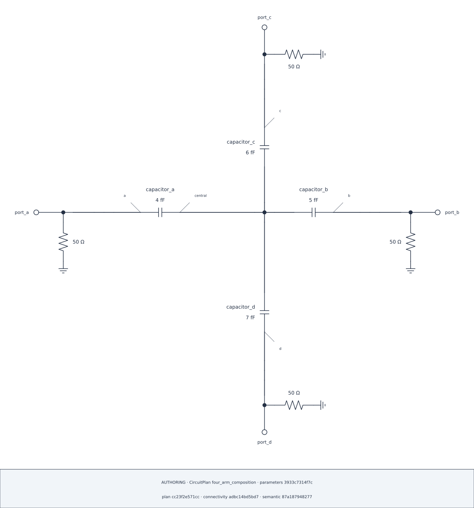

## Lesson 4 — Reuse the completed recipe {#lesson-ch6-reuse}

### Convert captured choices back to an editable composition

The captured composition is detached and immutable. `to_composition()` checks
the exact Plan identity and returns a new editable recipe; it does not freeze
pixels.

```{python}
#| id: ch6-reuse-completed-composition
fixed_four_arm = four_arm_cross.composition.to_composition(plan=four_arm_plan)
fixed_four_arm.show()
four_arm_fixed = four_arm_plan.render_schematic(
    CircuitDiagramSpec(layout=fixed_four_arm, theme=Theme.AUTO)
)
four_arm_fixed.show()
```

::: {.content-visible when-format="html"}

{#fig-ch6-four-arm-fixed .lightbox fig-alt="Four-arm circuit rendered from a detached fixed composition with the requested Cross retained."}

[Open the SVG](../figures/06-four-arm-fixed.svg)

:::

```{python}
#| id: ch6-show-fixed-audit
four_arm_fixed.audit.show()
```

Rendering remeasures current labels and geometry. An incompatible parameter
point can therefore fail rather than silently search for another layout.
