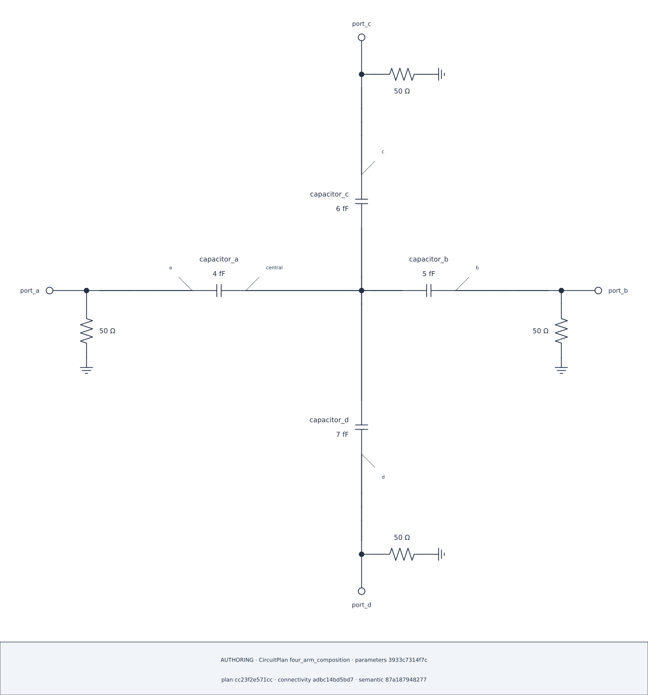

## Lesson 4 — Reuse the full explicit layout {#lesson-ch6-reuse}

Current source cells use full explicit layouts bound to fresh preparation. Stored figures and Notebook outputs retain their original execution identities; this source-only update does not regenerate them.

### Round-trip the same captured full layout

`CircuitDiagramResult.layout` is a readonly full-layout projection.
`SchematicLayout.from_json()` reconstructs those exact declarations against
the same preparation; it does not remap refs to another Plan or parameter point.

```{python}
#| id: ch6-reuse-completed-composition
from scnsim import SchematicLayout

# Lossless geometry is bound to the same immutable captured point/options.
fixed_four_arm = SchematicLayout.from_json(
    four_arm_preparation, four_arm_cross.layout.to_json(),
)
four_arm_fixed = four_arm_plan.render_schematic(
    CircuitDiagramSpec(layout=fixed_four_arm, theme=Theme.AUTO)
)
four_arm_fixed.show()
```

::: {.content-visible when-format="html"}

{#fig-ch6-four-arm-fixed .lightbox fig-alt="Four-arm circuit rendered from a detached fixed composition with the requested Cross retained."}

[Open the SVG](../figures/06-four-arm-fixed.svg)

:::

```{python}
#| id: ch6-show-fixed-audit
four_arm_fixed.audit.show()
```

A different parameter point or presentation options require fresh preparation
and a newly authored layout. Existing refs are never silently rebound.
