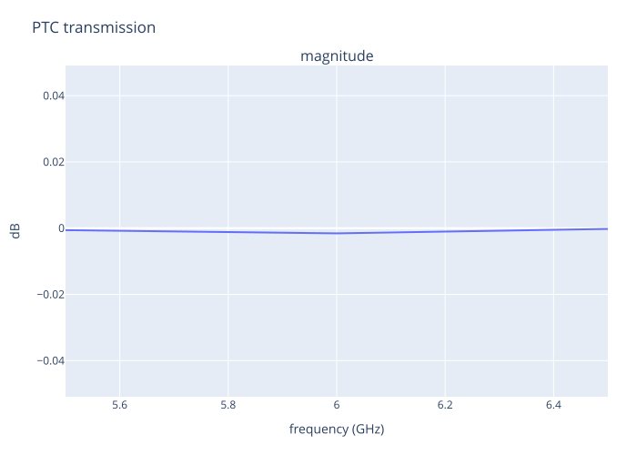

| frequency (GHz) | Re(S21) | Im(S21) | |S21| | |S21| (dB) |
|---:|---:|---:|---:|---:|
| 5.5 | 0.824520590917 | 0.565708621976 | 0.999930222478 | -0.000606101003919 |
| 6 | 0.810298980225 | 0.585707332533 | 0.999818741941 | -0.00157453019643 |
| 6.5 | 0.759576319774 | 0.650376824565 | 0.999973099384 | -0.000233658923228 |

[Download exact complex samples](../figures/04-ptc-direct-s21.csv).
