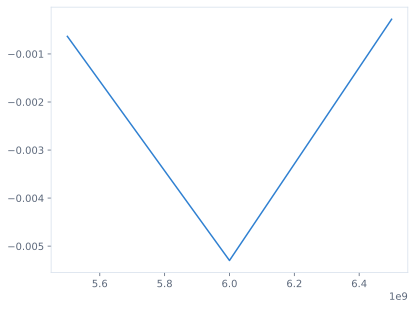

| frequency (GHz) | Re(S21) | Im(S21) | |S21| | |S21| (dB) |
|---:|---:|---:|---:|---:|
| 5.5 | 0.824498492954 | 0.565734964684 | 0.999926904903 | -0.000634919151989 |
| 6 | 0.804702202719 | 0.592650994945 | 0.999390232527 | -0.00529798841093 |
| 6.5 | 0.759539679827 | 0.650411636696 | 0.999967910676 | -0.000278728801578 |

[Download exact complex samples](../figures/04-raw-direct-s21.csv).
