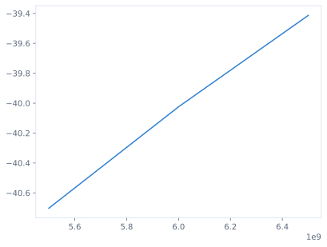
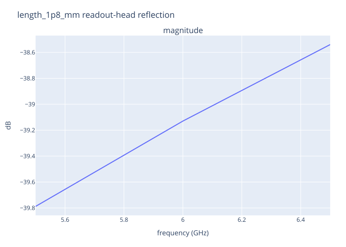
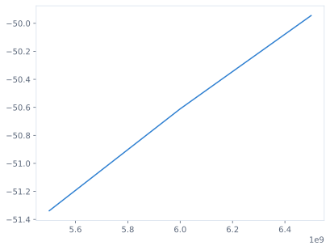

### Three exact Direct points

| point | status | complete named S channels |
|---|---|---:|
| `baseline` | success | 16 |
| `length_1p8_mm` | success | 16 |
| `capacitance_times_170_over_175` | success | 16 |

Every successful point retains all 16 output-from-input channels in the CSV. The plots below show only the explicitly named `s_readout_head_from_readout_head` reflection example.

