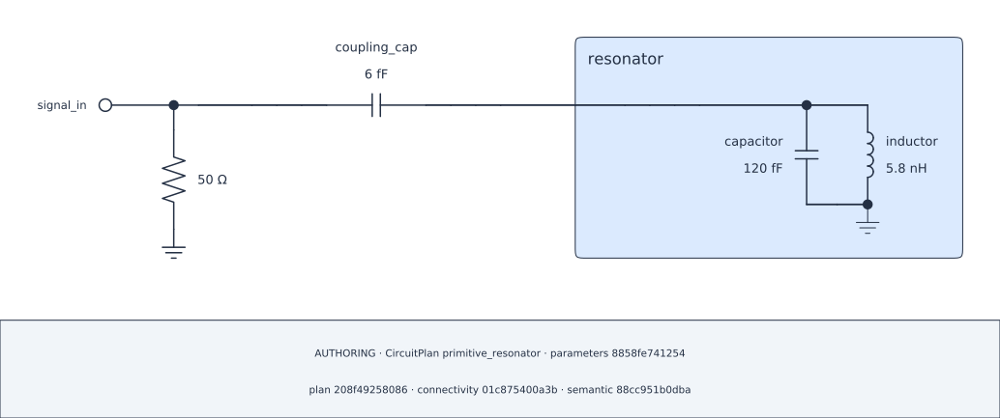

> **Source candidate / CONVERGING.** Authoring figures are genuine exports
> bound to the corresponding source checkpoints, not evidence that every cell
> or numerical request has executed. The website runs no kernels or solvers;
> the generated Notebook remains zero-output.

A tunable value starts as an independent, named input—not as a property of a
subsystem or a component. It becomes part of a particular `CircuitPlan` only
when a real physical component consumes its `ParameterRef` and that component
is registered in the live Plan.

## Lesson 4.1 — Define inputs independently {#ch4-definitions}

Create definitions before any circuit exists. Each returned `ParameterRef` is
immutable and unassigned: allocating it neither registers a Plan input nor
changes a component.

```{python}
#| id: define-parameter-inputs
from scnsim import ParameterDefinitions, ParameterSpec, components, units as u

inputs = ParameterDefinitions(id="readout_design")
capacitance = inputs.parameter(
    id="capacitance",
    baseline=110.0 * u.fF,
    spec=ParameterSpec(unit=u.fF),
)
inductance = inputs.parameter(
    id="inductance",
    baseline=5.8 * u.nH,
    spec=ParameterSpec(unit=u.nH),
)
```

`ParameterSpec` owns the scalar unit and dimensional validation used by the
physical binding. It does not set optimizer bounds, targets, or mutability.
The two refs remain independent even if another definition uses the same value.

`id="readout_design"` is a stable logical definitions namespace, not a notebook
caption or Python variable name. Within that collection, the local parameter
id is its stable key: recreating the same collection and local id compatibly is
intentional, while incompatible definitions are rejected when a physical field
consumes them. Unrelated designs should use their own collection identities
rather than casually reusing these keys.

## Lesson 4.2 — Bind refs through physical fields {#ch4-binding}

Now declare the complete familiar resonator. Passing a ref into an actual
factory slot is the binding step. Adding that component to `resonator` makes
the containing Plan adopt its consumed definition closure; merely listing a ref
in a `ParameterSet` would not do so.

```{python}
#| id: create-parameterized-plan
from scnsim import CircuitPlan

plan = CircuitPlan(id="primitive_resonator")
resonator = plan.subsystem(id="resonator")
capacitor = resonator.add(
    components.capacitor(id="capacitor", capacitance=capacitance)
)
inductor = resonator.add(
    components.inductor(id="inductor", inductance=inductance)
)
resonator_bus = resonator.bus(id="terminal")
resonator.parallel(
    id="parallel_lc",
    start=resonator_bus,
    branches=((capacitor,), (inductor,)),
    end=resonator.ground,
)
terminal = resonator.expose_pin(id="terminal", at=resonator_bus)
```

```{python}
#| id: complete-parameterized-root
signal_bus = plan.bus(id="signal_boundary")
resonator_root_bus = plan.bus(id="resonator_node")
coupling_cap = plan.add(
    components.capacitor(id="coupling_cap", capacitance=6.0 * u.fF)
)
plan.series(
    id="coupling",
    start=signal_bus,
    elements=(coupling_cap,),
    end=resonator_root_bus,
)
plan.link(id="resonator_terminal", endpoints=(resonator_root_bus, terminal))
plan.add_port(
    id="signal_in",
    at=signal_bus,
    role="terminated",
    reference_impedance=50.0 * u.ohm,
)
resonator_node = resonator_root_bus.node
```

The literal 6 fF coupler and 50-ohm Port are fixed: literals do not secretly
create tunable refs. Conversely, an unused definition added to `inputs` later
does not change the definitions this Plan has adopted.

## Lesson 4.3 — Review a bound model, then select a point {#ch4-point}

The Plan and its diagram make the assignment reviewable: `readout_design /
capacitance` consumes the capacitor's `capacitance` field, and
`readout_design / inductance` consumes the inductor's `inductance` field.
This is a physical binding table, not an analysis result.

```{python}
#| id: inspect-parameter-bindings
from scnsim import CircuitDiagramSpec

baseline_diagram = plan.render_schematic(CircuitDiagramSpec())
baseline_diagram.audit.show()
```

A `ParameterSet` supplies operation-time values for this already-bound Plan;
it never mutates its baseline. A ref that this exact Plan does not consume is
rejected rather than ignored.

```{python}
#| id: select-parameter-point
from scnsim import CircuitRun, DiagonalRootSpec, ParameterSet, ReductionPipeline

selected_parameters = ParameterSet({capacitance: 120.0 * u.fF})
run = CircuitRun(plan=plan, workspace="workspaces/parameter-course")
quantity_view = run.original.reduce(
    ReductionPipeline().retain(resonator_node)
)
root_spec = DiagonalRootSpec(
    coordinate=resonator_node,
    root_hint=6.0 * u.GHz,
)
```

```{python}
#| id: evaluate-selected-parameter-point
root = run.evaluate(quantity_view, root_spec, parameters=selected_parameters)
```

```{python}
#| id: show-selected-parameter-result
root.show()
```

```{python}
#| id: render-selected-parameter-diagram
selected_diagram = plan.render_schematic(
    CircuitDiagramSpec(), parameters=selected_parameters
)
selected_diagram.show()
```

::: {.content-visible when-format="html"}

{#fig-04-selected-parameter .lightbox fig-alt="Authoring diagram of the resonator at the selected parameter point."}

[Open the SVG](figures/04-selected-parameter.svg).

:::

```{python}
#| id: inspect-selected-parameter-audit
selected_diagram.audit.show()
```

The calculation and diagram use the same selected point, while `plan` retains
its 110 fF / 5.8 nH baseline. A shared ref may intentionally feed several
physical fields or Plans; separate refs with equal values remain separate
inputs. Rendering snapshots the mutable Plan at this point; it does not seal a
Plan through `CircuitRun` or execute an analysis.

## Lesson 4.4 — Reuse identities deliberately {#ch4-reuse}

`capacitance` and `capacitance_peer` have equal 110 fF baselines but distinct
identities. `capacitance` may fan out intentionally: its use in both physical
fields below is still one input, not two independently tunable variables. The
same definitions collection can also supply a separately assembled compatible
Plan; each Plan adopts only the refs its own fields consume.

```{python}
#| id: define-distinct-and-reused-refs
capacitance_peer = inputs.parameter(
    id="capacitance_peer",
    baseline=110.0 * u.fF,
    spec=ParameterSpec(unit=u.fF),
)

second_plan = CircuitPlan(id="second_primitive_resonator")
second_resonator = second_plan.subsystem(id="resonator")
second_capacitor = second_resonator.add(
    components.capacitor(id="capacitor", capacitance=capacitance)
)
fanout_capacitor = second_resonator.add(
    components.capacitor(id="fanout_capacitor", capacitance=capacitance)
)
peer_capacitor = second_resonator.add(
    components.capacitor(id="peer_capacitor", capacitance=capacitance_peer)
)
second_inductor = second_resonator.add(
    components.inductor(id="inductor", inductance=inductance)
)
```

```{python}
#| id: assemble-reused-second-resonator
second_resonator_bus = second_resonator.bus(id="terminal")
second_resonator.parallel(
    id="parallel_lc",
    start=second_resonator_bus,
    branches=(
        (second_capacitor,),
        (fanout_capacitor,),
        (peer_capacitor,),
        (second_inductor,),
    ),
    end=second_resonator.ground,
)
second_terminal = second_resonator.expose_pin(
    id="terminal",
    at=second_resonator_bus,
)
```

```{python}
#| id: assemble-reused-second-root
second_signal_bus = second_plan.bus(id="signal_boundary")
second_root_bus = second_plan.bus(id="resonator_node")
second_coupler = second_plan.add(
    components.capacitor(id="coupling_cap", capacitance=6.0 * u.fF)
)
second_plan.series(
    id="coupling",
    start=second_signal_bus,
    elements=(second_coupler,),
    end=second_root_bus,
)
second_plan.link(
    id="resonator_terminal",
    endpoints=(second_root_bus, second_terminal),
)
second_plan.add_port(
    id="signal_in",
    at=second_signal_bus,
    role="terminated",
    reference_impedance=50.0 * u.ohm,
)
```

Here the original `plan` and `second_plan` reuse compatible independent
definitions. The second Plan deliberately has three parallel capacitor branches
to make shared fan-out and the distinct equal-baseline ref observable; it is not
the original one-capacitor resonator model.

```{python}
#| id: inspect-second-plan-binding-audit
second_diagram = second_plan.render_schematic(CircuitDiagramSpec())
second_diagram.audit.show()
```

[Previous](03_evaluate_quantity.qmd) · [Next](05_sweep_parameters.qmd)
