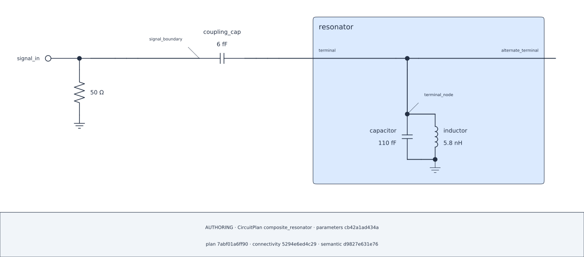

> **Source candidate / CONVERGING.** Authoring figures are genuine exports
> bound to the corresponding source checkpoints, not evidence that every cell
> or numerical request has executed. The website runs no kernels or solvers;
> the generated Notebook remains zero-output.

## Lesson 9.1 — Define the factory boundary {#ch9-factory}

### Define the project Library and Composite factory

The `Library` class defines a project catalog. Its factory method authors and
builds one complete Composite component; a factory call returns that component
instance. Only the pins, coordinates, and parameters the factory explicitly
publishes may cross from its internal declaration to an outer Plan.

The factory packages the already-understood grounded LC so another Plan can use
its one published terminal and tuning parameters without taking ownership of
its private capacitor, inductor, or ground relation.

```{python}
#| id: define-library-composite-target
from scnsim import CompositePlan, Library, ParameterRef, components, units as u


class ResonatorLibrary(Library):
    """Project-owned reusable resonator catalog."""

    def parallel_linear_lc_resonator(self, *, id, capacitance, inductance):
        """Build one grounded LC with public terminal and parameters."""
        # Create the factory-owned detached declaration.
        composite = CompositePlan(id=id, library=self)

        # Bind supplied refs through native physical fields first.
        capacitor = composite.add(
            components.capacitor(id="capacitor", capacitance=capacitance)
        )
        inductor = composite.add(
            components.inductor(id="inductor", inductance=inductance)
        )
        if isinstance(capacitance, ParameterRef):
            composite.expose_parameter(id="capacitance", parameter=capacitance)
        if isinstance(inductance, ParameterRef):
            composite.expose_parameter(id="inductance", parameter=inductance)

        # Add their grounded parallel structure.
        terminal_bus = composite.bus(id="terminal")
        composite.parallel(
            id="parallel_lc",
            start=terminal_bus,
            branches=((capacitor,), (inductor,)),
            end=composite.ground,
        )

        # Publish the supported boundary and build one immutable instance.
        composite.expose_pin(id="terminal", at=terminal_bus)
        composite.expose_pin(id="alternate_terminal", at=terminal_bus)
        composite.expose_coordinate(id="terminal_node", at=terminal_bus)
        return composite.build()


components_library = ResonatorLibrary()
fixed_resonator = components_library.parallel_linear_lc_resonator(
    id="fixed_resonator",
    capacitance=110.0 * u.fF,
    inductance=5.8 * u.nH,
)
```

`components_library` is a catalog instance with one complete reusable factory;
`composite.build()` returns an immutable `ComponentInstance`, never a “frozen
Composite.” That instance exposes only the boundary and ParameterRefs published
in the method.

`fixed_resonator` has fixed physical leaves and no public parameter lookup:
literal inputs create no `ParameterRef`. The ref-backed main example below
continues to publish only refs that were already physically bound.

> **Source-provenance note.** A Library class or factory may be defined in a
> notebook when Python's normalized source and line cache retain its exact
> class/method source; unavailable source fails closed. This complete cell is
> therefore a valid target declaration surface, not an instruction to move every
> executable Library into a `.py` file.

## Lesson 9.2 — Use the published component boundary {#ch9-instance}

### Build an instance and its outer Plan

The outer scope receives the immutable `ComponentInstance` and reads only its
public pin, coordinate, and ParameterRef handles.

```{python}
#| id: build-composite-instance-and-plan
from scnsim import CircuitPlan, ParameterDefinitions, ParameterSpec

inputs = ParameterDefinitions(id="readout_design")
capacitance = inputs.parameter(
    id="capacitance", baseline=110.0 * u.fF, spec=ParameterSpec(unit=u.fF)
)
inductance = inputs.parameter(
    id="inductance", baseline=5.8 * u.nH, spec=ParameterSpec(unit=u.nH)
)
plan = CircuitPlan(id="composite_resonator")
resonator = plan.add(
    components_library.parallel_linear_lc_resonator(
        id="resonator",
        capacitance=capacitance,
        inductance=inductance,
    )
)
resonator_terminal = resonator.pin("terminal")
resonator_alternate_terminal = resonator.pin("alternate_terminal")
resonator_coordinate = resonator.coordinate("terminal_node")
resonator_capacitance = resonator.parameter("capacitance")
resonator_inductance = resonator.parameter("inductance")
```

`resonator_terminal` is the `PinRef` parent wiring boundary. The public
`resonator_coordinate` is a `CoordinateRef` for analysis selection and cannot
wire; the ParameterRefs support parameter work.

`resonator_alternate_terminal` is a differently named ordinary Pin on the
same intrinsic node. This lesson deliberately leaves it externally open;
the boundary remains visible without an added wire, load, or analysis
coordinate. Even an entirely externally open Composite interface is legal
when its native internal assembly is complete, though numerical solvability
is a separate question. Selecting these equivalent pins with `.between()`
would reject rather than manufacture a two-terminal path.

### Wire the published terminal and promote the Port

Create the signal root bus required by the Port, register the 6 fF coupler,
then end that structural relation directly at the published `PinRef`. The
already exposed `CoordinateRef` needs no extra parent bus solely for analysis.

```{python}
#| id: wire-composite-instance-target
signal_boundary_bus = plan.bus(id="signal_boundary")
coupler = plan.add(
    components.capacitor(id="coupling_cap", capacitance=6.0 * u.fF)
)
coupling = plan.series(
    id="coupling",
    start=signal_boundary_bus,
    elements=(coupler,),
    end=resonator_terminal,
)
signal_port = plan.add_port(
    id="signal_in",
    at=signal_boundary_bus,
    role="terminated",
    reference_impedance=50.0 * u.ohm,
)
```

The outer Plan has no access to the factory's private C, L, or ground.
`resonator_terminal` is the public wiring `PinRef`; `resonator_coordinate` is
an analytical `CoordinateRef` and cannot wire or carry a Port.

If a series midpoint tap must be named, declare a junction `BusRef` first (and
take `junction_bus.tap(...)` for a distinct attachment when needed), then split
the physical chain into one series relation ending there and another starting
there. A generated private intermediate node is not an addressable pin or tap.

### Render the authored declaration

```{python}
#| id: render-composite-factory-target
from scnsim import CircuitDiagramSpec, Theme

diagram = plan.render_schematic(
    CircuitDiagramSpec(
        representation="authoring",
        theme=Theme.AUTO,
        show_parameter_values=True,
        show_provenance=True,
    )
)
diagram.show()
```

::: {.content-visible when-format="html"}

{#fig-09-composite-factory .lightbox fig-alt="Factory-built grounded LC with an externally open alternate terminal, coupling capacitor, and Port."}

[Open the SVG](figures/09-composite-factory.svg).

:::

The drawing shows the assembled outer declaration; inspect factory publication
and audit evidence separately.

### Inspect what the factory publishes

```{python}
#| id: inspect-composite-factory-target
from IPython.display import display

published_handles = {
    "terminal": resonator_terminal,
    "terminal coordinate": resonator_coordinate,
    "capacitance": resonator_capacitance,
    "inductance": resonator_inductance,
}
display(published_handles)
```

```{python}
#| id: inspect-composite-factory-audit
diagram.audit.show()
```

The factory publishes one electrical terminal, one coordinate, and two public
parameters. Its capacitor, inductor, and ground remain private factory
structure.

[Previous](08_create_library.qmd) · [Next](10_use_custom_component.qmd)
