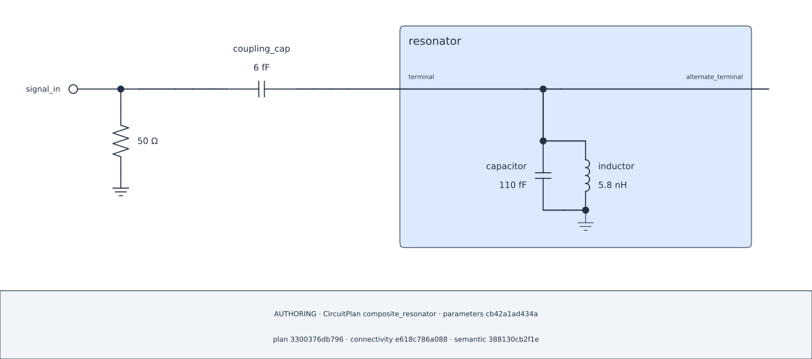

> **Source candidate / CONVERGING.** Authoring figures are genuine exports
> bound to the corresponding source checkpoints, not evidence that every cell
> or numerical request has executed. The website runs no kernels or solvers;
> the generated Notebook remains zero-output.

## Lesson 10.1 — Rebuild the factory in this Chapter {#ch10-factory}

### Define the project Library and Composite factory

The same complete factory is repeated so this lesson starts in a fresh kernel.
The `Library` class defines a project catalog; its factory method authors and
builds one complete Composite, and a factory call returns that component
instance. Only explicitly published pins, coordinates, and parameters cross to
the outer Plan.

The physical question is unchanged: couple one grounded LC to a 50 ohm port.
This time the outer Plan consumes a reusable component's public boundary rather
than rebuilding the LC leaves itself.

```{python}
#| id: rebuild-library-composite-target
from scnsim import CompositePlan, Library, ParameterRef, components, units as u


class ResonatorLibrary(Library):
    """Project-owned reusable resonator catalog."""

    def parallel_linear_lc_resonator(self, *, id, capacitance, inductance):
        """Build one grounded LC with public terminal and parameters."""
        # Create the factory-owned detached declaration.
        composite = CompositePlan(id=id, library=self)

        # Bind supplied refs through native physical fields first.
        capacitor = composite.add(
            components.capacitor(id="capacitor", capacitance=capacitance)
        )
        inductor = composite.add(
            components.inductor(id="inductor", inductance=inductance)
        )
        if isinstance(capacitance, ParameterRef):
            composite.expose_parameter(id="capacitance", parameter=capacitance)
        if isinstance(inductance, ParameterRef):
            composite.expose_parameter(id="inductance", parameter=inductance)

        # Add their grounded parallel structure.
        terminal_bus = composite.bus(id="terminal")
        composite.parallel(
            id="parallel_lc",
            start=terminal_bus,
            branches=((capacitor,), (inductor,)),
            end=composite.ground,
        )

        # Publish the supported boundary and freeze one instance.
        composite.expose_pin(id="terminal", at=terminal_bus)
        composite.expose_pin(id="alternate_terminal", at=terminal_bus)
        composite.expose_coordinate(id="terminal_node", at=terminal_bus)
        return composite.build()


components_library = ResonatorLibrary()
```

The completed factory publishes the only handles this outer lesson may use.

> **Source-provenance note.** A Library class or factory may be defined in a
> notebook when Python's normalized source and line cache retain its exact
> class/method source; unavailable source fails closed. This complete cell is
> therefore a valid target declaration surface, not an instruction to move every
> executable Library into a `.py` file.

## Lesson 10.2 — Couple the reusable boundary {#ch10-assemble}

### Build the reusable instance in an outer Plan

The outer scope accepts the component as one complete peer. It retains direct
handles only to the factory's published wiring pin, analytical coordinate, and
ParameterRefs.

```{python}
#| id: build-reusable-instance-and-plan
from scnsim import CircuitPlan, ParameterDefinitions, ParameterSpec

inputs = ParameterDefinitions(id="readout_design")
capacitance = inputs.parameter(
    id="capacitance", baseline=110.0 * u.fF, spec=ParameterSpec(unit=u.fF)
)
inductance = inputs.parameter(
    id="inductance", baseline=5.8 * u.nH, spec=ParameterSpec(unit=u.nH)
)
plan = CircuitPlan(id="composite_resonator")
resonator = plan.add(
    components_library.parallel_linear_lc_resonator(
        id="resonator",
        capacitance=capacitance,
        inductance=inductance,
    )
)
resonator_terminal = resonator.pin("terminal")
resonator_alternate_terminal = resonator.pin("alternate_terminal")
resonator_coordinate = resonator.coordinate("terminal_node")
resonator_capacitance = resonator.parameter("capacitance")
resonator_inductance = resonator.parameter("inductance")
```

`resonator_terminal` is the public wiring `PinRef`; `resonator_coordinate` is
the public analytical `CoordinateRef`. Keep these handles rather than reaching
into factory-owned leaves: a coordinate cannot wire or carry a Port.

`resonator_alternate_terminal` is a differently named ordinary Pin on the
same intrinsic node. This lesson deliberately leaves it externally open;
the boundary remains visible without an added wire, load, or analysis
coordinate. Even an entirely externally open Composite interface is legal
when its native internal assembly is complete, though numerical solvability
is a separate question. Selecting these equivalent pins with `.between()`
would reject rather than manufacture a two-terminal path.

### Connect the published terminal at the root

No private capacitor, inductor, or factory bus appears in this outer wiring.
The exposed coordinate needs no extra parent bus solely for analysis.

```{python}
#| id: wire-reusable-component-target
signal_boundary_bus = plan.bus(id="signal_boundary")
coupler = plan.add(
    components.capacitor(id="coupling_cap", capacitance=6.0 * u.fF)
)
coupling = plan.series(
    id="coupling",
    start=signal_boundary_bus,
    elements=(coupler,),
    end=resonator_terminal,
)
signal_port = plan.add_port(
    id="signal_in",
    at=signal_boundary_bus,
    role="terminated",
    reference_impedance=50.0 * u.ohm,
)
```

The completed root declaration uses the public terminal, the 6 fF coupler, and
the terminated Port only. If a series midpoint tap must be named, declare a
junction `BusRef` first (and take `junction_bus.tap(...)` for a distinct
attachment when needed), then split the physical chain into two series
relations. A generated private intermediate node is not an addressable pin or
tap.

### Render the reused component

```{python}
#| id: render-reusable-component-target
from scnsim import CircuitDiagramSpec, Theme

diagram = plan.render_schematic(
    CircuitDiagramSpec(
        representation="authoring",
        theme=Theme.AUTO,
        show_parameter_values=True,
        show_provenance=True,
    )
)
diagram.show()
```

::: {.content-visible when-format="html"}

{#fig-10-reusable-component .lightbox fig-alt="Reusable grounded LC connected through its public terminal while its equivalent alternate terminal remains open."}

[Open the SVG](figures/10-reusable-component.svg).

:::

The rendered assembly is followed by an intentional public-handle display and
then the audit table.

### Inspect the public surface and authored audit

```{python}
#| id: inspect-custom-component-target
from IPython.display import display

published_handles = {
    "terminal": resonator_terminal,
    "terminal coordinate": resonator_coordinate,
    "capacitance": resonator_capacitance,
    "inductance": resonator_inductance,
}
display(published_handles)
```

```{python}
#| id: inspect-custom-component-audit
diagram.audit.show()
```

```{python}
#| id: create-reusable-coordinate-run
from scnsim import CircuitRun, ReductionPipeline

run = CircuitRun(
    plan=plan,
    workspace="workspaces/reusable-coordinate",
)
```

```{python}
#| id: derive-reusable-coordinate-view
coordinate_view = run.original.reduce(
    ReductionPipeline().retain(resonator_coordinate)
)
```

This declares a derived analysis View only: it performs no solve or evaluation,
creates no Spec or request, and does not call a `NetworkViewRef.show()` surface.
The public `PinRef` wires the parent circuit, while the published
`CoordinateRef` selects analysis without an extra root alias.

The Composite physical fields consume the ParameterRefs; the containing Plan
adopts that closed component definition; and the parent wires the public
`PinRef`. A caller may use the published ParameterRefs and CoordinateRef.
Reuse changes factory provenance and structural ownership.

[Previous](09_add_composite_factory.qmd) · [Next](11_review_customize_schematic.qmd)
