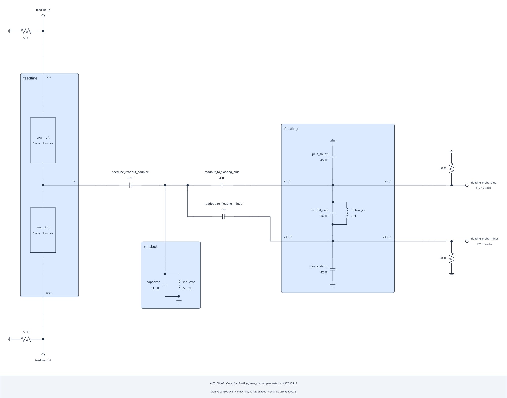

> **Source candidate / CONVERGING.** Authoring figures are genuine exports
> bound to the corresponding source checkpoints, not evidence that every cell
> or numerical request has executed. The website runs no kernels or solvers;
> the generated Notebook remains zero-output.

This is the complete three-Subsystem capstone: a two-section feedline, a
grounded readout LC, and a floating pair, with terminated feedline ends and
nonloading floating probes. First author and inspect that one complete Plan;
only afterward ask for a View that compensates the declared probe loads. The
original diagram remains the physical Plan, not a post-PTC circuit.

## Lesson 13.1 — Build the feedline {#ch13-feedline}

### Declare the root Plan and the feedline scope

The root has exactly three inline Subsystems: `feedline`, `readout`, and
`floating`. Each CPW body below is a finite-pi discretization, not an exact
distributed equivalent.

```{python}
#| id: build-ptc-root-and-feedline
from scnsim import (
    CircuitPlan,
    ParameterDefinitions,
    ParameterSpec,
    RLGC,
    RLGCParameterSpec,
    components,
    units as u,
)

plan = CircuitPlan(id="floating_probe_course")
feedline = plan.subsystem(id="feedline")
rlgc = RLGC(
    conductors=("signal",),
    reference_conductor="ground",
    resistance_per_length=[[0.0]] * u.ohm / u.m,
    inductance_per_length=[[420.0]] * u.nH / u.m,
    conductance_per_length=[[0.0]] * u.S / u.m,
    capacitance_per_length=[[175.0]] * u.pF / u.m,
)
inputs = ParameterDefinitions(id="floating_probe_design")
line_rlgc = inputs.parameter(
    id="line_rlgc",
    baseline=rlgc,
    spec=RLGCParameterSpec(
        conductors=("signal",),
        reference_conductor="ground",
    ),
)
readout_capacitance = inputs.parameter(
    id="readout_capacitance",
    baseline=110.0 * u.fF,
    spec=ParameterSpec(unit=u.fF),
)
readout_inductance = inputs.parameter(
    id="readout_inductance",
    baseline=5.8 * u.nH,
    spec=ParameterSpec(unit=u.nH),
)
mutual_capacitance = inputs.parameter(
    id="mutual_capacitance",
    baseline=16.0 * u.fF,
    spec=ParameterSpec(unit=u.fF),
)
mutual_inductance = inputs.parameter(
    id="mutual_inductance",
    baseline=7.0 * u.nH,
    spec=ParameterSpec(unit=u.nH),
)
plus_shunt_capacitance = inputs.parameter(
    id="plus_shunt_capacitance",
    baseline=45.0 * u.fF,
    spec=ParameterSpec(unit=u.fF),
)
minus_shunt_capacitance = inputs.parameter(
    id="minus_shunt_capacitance",
    baseline=42.0 * u.fF,
    spec=ParameterSpec(unit=u.fF),
)
```

`plan` now owns the `feedline` scope. `line_rlgc` is one independent whole-RLGC
ref intentionally consumed by both native line fields; the remaining refs bind
the readout and floating physical fields below.

### Add the two independent N=1 line bodies

```{python}
#| id: add-ptc-feedline-bodies
left = feedline.add(
    components.transmission_line(
        id="left",
        length=1.0 * u.mm,
        rlgc=line_rlgc,
        n_sections=1,
    )
)
right = feedline.add(
    components.transmission_line(
        id="right",
        length=1.0 * u.mm,
        rlgc=line_rlgc,
        n_sections=1,
    )
)
```

`left` and `right` are independent multi-terminal bodies. The next cell gives
their signal pins one shared local tap boundary and distinct section ends.

### Declare the local feedline buses

The reference conductor remains RLGC metadata. This capstone uses ordinary
`BusRef` endpoints: `middle_bus` is the shared electrical node between its two
line sections and the public coupling pin.

```{python}
#| id: declare-ptc-feedline-taps
input_bus = feedline.bus(id="input")
middle_bus = feedline.bus(id="middle")
output_bus = feedline.bus(id="output")
```

These three buses are direct electrical endpoints. Named `TapRef`s are useful
only when an attachment needs its own presentation handle, as Chapter 12 shows.

### Place both bodies and expose the feedline boundary

```{python}
#| id: wire-and-expose-ptc-feedline
left_head_pin = left.pin("head", conductor="signal")
left_tail_pin = left.pin("tail", conductor="signal")
right_head_pin = right.pin("head", conductor="signal")
right_tail_pin = right.pin("tail", conductor="signal")

left_section = feedline.series(
    id="left_section",
    start=input_bus,
    elements=(
        left.between(left_head_pin, left_tail_pin),
    ),
    end=middle_bus,
)
right_section = feedline.series(
    id="right_section",
    start=middle_bus,
    elements=(
        right.between(right_head_pin, right_tail_pin),
    ),
    end=output_bus,
)
feedline_input_pin = feedline.expose_pin(id="input", at=input_bus)
feedline_coupling_pin = feedline.expose_pin(id="tap", at=middle_bus)
feedline_output_pin = feedline.expose_pin(id="output", at=output_bus)
```

The returned values are `PinRef`s: `feedline_input_pin`,
`feedline_coupling_pin`, and `feedline_output_pin`. The authored public ID
`tap` names a Pin boundary here; it does not make the returned handle a TapRef.

The local bus-to-terminal map is explicit:

| Local bus | Authored terminal(s) |
| --- | --- |
| input bus | left signal head |
| middle bus | left signal tail + right signal head |
| output bus | right signal tail |

`head` and `tail` state authored terminal orientation for each native line
body; they do not infer physical flow.

## Lesson 13.2 — Add the grounded readout {#ch13-readout}

### Declare the grounded readout LC

The 110 fF/5.8 nH grounded readout LC is the local lumped approximation for
the target quarter-wave mode. It is not an exact distributed-equivalence claim.

```{python}
#| id: build-ptc-readout-subsystem
readout = plan.subsystem(id="readout")
readout_capacitor = readout.add(
    components.capacitor(
        id="capacitor",
        capacitance=readout_capacitance,
    )
)
readout_inductor = readout.add(
    components.inductor(
        id="inductor",
        inductance=readout_inductance,
    )
)
readout_bus = readout.bus(id="node")
readout_parallel = readout.parallel(
    id="parallel_lc",
    start=readout_bus,
    branches=((readout_capacitor,), (readout_inductor,)),
    end=readout.ground,
)
readout_terminal = readout.expose_pin(
    id="readout_node",
    at=readout_bus,
)
```

`readout_terminal` is the one public PinRef the root uses to join this LC. Its
two independent refs are physically bound here even though this Chapter does
not vary them.

## Lesson 13.3 — Add the floating subsystem {#ch13-floating}

### Declare the floating subsystem leaves

The three capacitance refs remain distinct: mutual 16 fF, plus shunt 45 fF,
and minus shunt 42 fF baselines. Each is bound to its named native field.

```{python}
#| id: build-ptc-floating-parameters-and-leaves
floating = plan.subsystem(id="floating")
plus_bus = floating.bus(id="plus")
minus_bus = floating.bus(id="minus")

mutual_cap = floating.add(
    components.capacitor(id="mutual_cap", capacitance=mutual_capacitance)
)
mutual_ind = floating.add(
    components.inductor(id="mutual_ind", inductance=mutual_inductance)
)
plus_shunt = floating.add(
    components.capacitor(
        id="plus_shunt",
        capacitance=plus_shunt_capacitance,
    )
)
minus_shunt = floating.add(
    components.capacitor(
        id="minus_shunt",
        capacitance=minus_shunt_capacitance,
    )
)
```

These real leaf bodies feed the mutual path, grounded shunts, and four public
pins over two intrinsic nodes in the next cell.

### Structure and expose the floating pair

```{python}
#| id: structure-and-expose-ptc-floating
mutual_network = floating.parallel(
    id="mutual_network",
    start=plus_bus,
    branches=((mutual_cap,), (mutual_ind,)),
    end=minus_bus,
)
plus_branch = floating.branch(
    id="plus_shunt",
    at=plus_bus,
    elements=(plus_shunt,),
    end=floating.ground,
)
minus_branch = floating.branch(
    id="minus_shunt",
    at=minus_bus,
    elements=(minus_shunt,),
    end=floating.ground,
)
plus_1 = floating.expose_pin(id="plus_1", at=plus_bus)
plus_2 = floating.expose_pin(id="plus_2", at=plus_bus)
minus_1 = floating.expose_pin(id="minus_1", at=minus_bus)
minus_2 = floating.expose_pin(id="minus_2", at=minus_bus)
```

Each pair exposes one intrinsic node through distinct ordinary public pins.
The couplers connect directly to `plus_1` and `minus_1`; only `plus_2` and
`minus_2` link to the existing root probe buses and coordinates. Left/right
placement is a separate presentation choice, not a physical pin role. No
component, Coordinate, or degree of freedom is added by these exposures.

Only the output pair links to the named root coordinate buses; the coupling
inputs terminate directly at the other public pins without reaching inside.

## Lesson 13.4 — Assemble root couplers and probes {#ch13-root}

### Declare root buses and their analysis aliases

```{python}
#| id: declare-ptc-root-buses
feedline_in_bus = plan.bus(id="feedline_in")
feedline_out_bus = plan.bus(id="feedline_out")
readout_root_bus = plan.bus(id="readout_node")
floating_plus_bus = plan.bus(id="floating_plus")
floating_minus_bus = plan.bus(id="floating_minus")

feedline_in_node = feedline_in_bus.node
feedline_out_node = feedline_out_bus.node
readout_node = readout_root_bus.node
floating_plus = floating_plus_bus.node
floating_minus = floating_minus_bus.node
```

The `floating_plus` and `floating_minus` aliases are root `ElectricNodeRef`s.
The next cell consumes the buses and child pins to complete the public boundary
links before any native root coupler is registered.

### Link child boundaries at the root

```{python}
#| id: wire-ptc-root-subsystems
plan.link(
    id="feedline_input_child",
    endpoints=(feedline_in_bus, feedline_input_pin),
)
plan.link(
    id="feedline_output_child",
    endpoints=(feedline_out_bus, feedline_output_pin),
)
plan.link(id="readout_child", endpoints=(readout_root_bus, readout_terminal))
plan.link(
    id="floating_plus_child",
    endpoints=(floating_plus_bus, plus_2),
)
plan.link(
    id="floating_minus_child",
    endpoints=(floating_minus_bus, minus_2),
)
```

These links consume only published child boundaries and named root buses. The
next cell registers the three native root capacitors before placing them.

### Register the three native root couplers

```{python}
#| id: add-ptc-root-couplers

feedline_coupler = plan.add(
    components.capacitor(
        id="feedline_readout_coupler",
        capacitance=6.0 * u.fF,
    )
)
plus_coupler = plan.add(
    components.capacitor(
        id="readout_to_floating_plus",
        capacitance=4.0 * u.fF,
    )
)
minus_coupler = plan.add(
    components.capacitor(
        id="readout_to_floating_minus",
        capacitance=3.0 * u.fF,
    )
)
```

The three direct `ElementUse` handles now feed separate ordered series
relations, preserving the electrical path of each coupling.

### Place the three couplers in semantic series order

```{python}
#| id: declare-ptc-root-coupler-series
feedline_readout = plan.series(
    id="feedline_readout",
    start=feedline_coupling_pin,
    elements=(feedline_coupler,),
    end=readout_root_bus,
)
readout_floating_plus = plan.series(
    id="readout_floating_plus",
    start=readout_root_bus,
    elements=(plus_coupler,),
    end=plus_1,
)
readout_floating_minus = plan.series(
    id="readout_floating_minus",
    start=readout_root_bus,
    elements=(minus_coupler,),
    end=minus_1,
)
```

The completed `plan` now has its physical root topology. The next cell promotes
its two terminated feedline ports and two raw nonloading probe handles.

### Promote raw loads and declared nonloading probes

The probes exist in the raw loaded Plan before any PTC operation.

```{python}
#| id: add-ptc-root-ports
feedline_in_port = plan.add_port(
    id="feedline_in",
    at=feedline_in_bus,
    role="terminated",
    reference_impedance=50.0 * u.ohm,
)
feedline_out_port = plan.add_port(
    id="feedline_out",
    at=feedline_out_bus,
    role="terminated",
    reference_impedance=50.0 * u.ohm,
)
probe_plus = plan.add_port(
    id="floating_probe_plus",
    at=floating_plus_bus,
    role="nonloading_probe",
    reference_impedance=50.0 * u.ohm,
)
probe_minus = plan.add_port(
    id="floating_probe_minus",
    at=floating_minus_bus,
    role="nonloading_probe",
    reference_impedance=50.0 * u.ohm,
)
```

`probe_plus` and `probe_minus` remain raw declared loads here, so their handles
can first be reviewed and then explicitly selected by the PTC pipeline.

```{python}
#| id: inspect-raw-loaded-ptc-probes
from IPython.display import display

display(
    {
        "feedline input": feedline_in_port,
        "feedline output": feedline_out_port,
        "floating plus probe": probe_plus,
        "floating minus probe": probe_minus,
    }
)
```

The four displayed handles establish the raw loaded boundary. Review the
complete physical Plan before choosing an analysis View; rendering neither
requires nor creates a `CircuitRun`.

### Render the authored physical declaration

```{python}
#| id: render-ptc-authoring-target
from scnsim import CircuitDiagramSpec, SchematicLayout, Theme
from scnsim.errors import SCNSimValidationError
from IPython.display import display

automatic = None
automatic_error = None
try:
    automatic = plan.render_schematic(
        CircuitDiagramSpec(
            representation="authoring",
            theme=Theme.AUTO,
            show_parameter_values=True,
            show_provenance=True,
        )
    )
except SCNSimValidationError as error:
    if error.stage != "schematic_layout":
        raise
    automatic_error = error
    display({
        "fixed Default layout unavailable": str(error),
        "stage": error.stage,
        "evidence": dict(error.evidence),
    })
if automatic is not None:
    display(automatic.show())
```

::: {.callout-note title="Current fixed Default layout limitation"}
This complete Plan currently reports `schematic_layout`: `fixed connector
intersects occupied geometry`. No Default SVG or audit is published for this
checkpoint. The typed failure is retained as `automatic_error`, while other
error stages still propagate. The successful explicit compositions below use
the same authored Plan; they do not substitute a different circuit.
:::

```{python}
#| id: inspect-ptc-authoring-audit
if automatic is not None:
    display(automatic.audit.show())
```

An available authoring audit confirms Plan-specific input-to-physical-field bindings,
declared buses, child boundaries, Ports, and three root Subsystems. The next
projection expands each finite-pi CPW body without turning that compiler detail
into an analysis View.

```{python}
#| id: render-ptc-compiled-projection
compiled = None
try:
    compiled = plan.render_schematic(
        CircuitDiagramSpec(
            representation="compiled",
            theme=Theme.AUTO,
            show_parameter_values=True,
            show_provenance=True,
        )
    )
except SCNSimValidationError as error:
    if error.stage != "schematic_layout":
        raise
    display({
        "compiled schematic layout unavailable": str(error),
        "stage": error.stage,
        "evidence": dict(error.evidence),
    })
if compiled is not None:
    display(compiled.show())
```

`compiled` makes the finite-pi expansion inspectable when its fixed layout is
available. A `schematic_layout` failure is reported without masking another
error or preventing the later authored-composition cells from running.

```{python}
#| id: inspect-ptc-compiled-audit
if compiled is not None:
    display(compiled.audit.show())
```

### Compose the parent wiring without changing the Plan {#ch13-composition}

The three root coupling structures and the one public `readout_terminal`
meet at the same declared readout bus. The readout needs no second Pin to hang
below a parent T: the renderer moves its whole Block and preserves its private
parallel LC. The following recipe retains both terminated feedline Ports and
both nonloading probes, along with all physical values and numerical requests.

First create a partial composition, then inspect its explicit settings and
omitted fields. The constructor, `automatic()`, and a missing layout share the
same fixed Default completion; there is no whole-manual setup requirement.
Inspection is read-only. Replacing a wiring group still requires every actual
attachment and arm in that group; Default does not guess missing manual wires.

```{python}
#| id: create-ptc-automatic-composition
from scnsim import DiagramAxis, DiagramSide, SchematicComposition

composition = SchematicComposition(plan=plan)
```

```{python}
#| id: inspect-ptc-automatic-composition
composition.show()
```

### Set the feedline axes and root peer order

The two ordered line sections run vertically. The root order names only the
three independent child regions, not the root coupler structures; connectors
are placed from their declared endpoints. These are drawing choices, not
physical-flow directions.

```{python}
#| id: configure-ptc-composition-blocks
composition.axis(feedline, DiagramAxis.VERTICAL)
composition.axis(left_section, DiagramAxis.VERTICAL)
composition.axis(right_section, DiagramAxis.VERTICAL)
composition.order(plan, members=(feedline, readout, floating))
```

### Replace the readout group's wiring

The inventory contains all four actual Block attachments even though the
`readout_child` Link lists only the bus and one Pin. A Bus is not an extra arm.

```{python}
#| id: replace-ptc-readout-wiring
wiring = composition.replace_wiring(at=readout_terminal)
```

The public Subsystem Pin selects the parent-facing wiring group. It aliases
the same group as `readout_root_bus`, never the readout's private internal
rail; if no legal outward group exists, selection fails instead of falling
back inward. `endpoint(readout_terminal)` resolves in this selected group.

```{python}
#| id: declare-ptc-double-tee-and-elbow
readout_t = wiring.tee(id="readout_attachment", branch=DiagramSide.BOTTOM)
split_t = wiring.tee(id="floating_split", branch=DiagramSide.BOTTOM)
lower_turn = wiring.elbow(
    id="floating_minus_turn", sides=(DiagramSide.TOP, DiagramSide.RIGHT),
)
```

```{python}
#| id: connect-ptc-double-tee-and-elbow
wiring.connect(composition.endpoint(feedline_readout, boundary="end"), readout_t.left)
wiring.connect(readout_t.bottom, composition.endpoint(readout_terminal))
wiring.connect(readout_t.right, split_t.left)
wiring.connect(split_t.right, composition.endpoint(readout_floating_plus, boundary="start"))
wiring.connect(split_t.bottom, lower_turn.top)
wiring.connect(lower_turn.right, composition.endpoint(readout_floating_minus, boundary="start"))
```

Every attachment and requested arm is connected once. The two Ts and L choose
local wire shapes on the existing node; they introduce no net, Tap, or analysis
Coordinate. Default and this custom recipe use the same public composition
path. The T sides constrain local arms, not global half-planes for distant
children. Measured Block and connector strips reserve channels before the
single routing realization; different-net crossings retain the existing jump
convention. Shape verification checks the actual visible arms separately from
A/B. Unsupported fixed geometry fails explicitly rather than retrying a
different placement, pose, or wiring tree.

### Choose complete Port poses

Place the equivalent public input boundaries on the left and output boundaries
on the right. This is presentation over ordinary pins, not a new pin role.

```{python}
#| id: orient-ptc-equivalent-public-pins
composition.terminal_side(plus_1, DiagramSide.LEFT)
composition.terminal_side(minus_1, DiagramSide.LEFT)
composition.terminal_side(plus_2, DiagramSide.RIGHT)
composition.terminal_side(minus_2, DiagramSide.RIGHT)
```

The existing four Ports keep their values and roles. Each setting below
atomically chooses a root-frame hollow-marker side and perpendicular
T-to-load/ground direction; it does not alter the PTC selection later.

```{python}
#| id: orient-ptc-port-blocks
composition.port_orientation(
    feedline_in_port, boundary_side=DiagramSide.TOP, load_side=DiagramSide.LEFT,
)
composition.port_orientation(
    feedline_out_port, boundary_side=DiagramSide.BOTTOM, load_side=DiagramSide.LEFT,
)
composition.port_orientation(
    probe_plus, boundary_side=DiagramSide.RIGHT, load_side=DiagramSide.TOP,
)
composition.port_orientation(
    probe_minus, boundary_side=DiagramSide.RIGHT, load_side=DiagramSide.BOTTOM,
)
```

### Keep each floating shunt's ground local

```{python}
#| id: set-ptc-local-ground-sides
composition.ground_side(plus_branch, DiagramSide.TOP)
composition.ground_side(minus_branch, DiagramSide.BOTTOM)
```

Each shunt retains its own ground occurrence rather than joining a scope-wide
ground tree. The readout's shared Parallel rail retains one local ground, and
Port loads keep their graphical roles. All glyphs denote the same electrical
reference. A ground-side setting may rotate its structure without reversing
the authored electrical endpoints.

```{python}
#| id: inspect-ptc-custom-composition
composition.show()
```

### Draw and audit the captured composition

```{python}
#| id: render-ptc-custom-composition
hinted = plan.render_schematic(
    CircuitDiagramSpec(
        representation="authoring",
        theme=Theme.AUTO,
        show_parameter_values=True,
        show_provenance=True,
        layout=composition,
    )
)
```

```{python}
#| id: show-ptc-custom-composition
hinted.show()
```

::: {.content-visible when-format="html"}

{#fig-13-ptc-custom-composition .lightbox fig-alt="Capstone with a readout beneath parent wiring, left coupling inputs, and right probe outputs."}

[Open the SVG](figures/13-ptc-custom-composition.svg).

:::

```{python}
#| id: inspect-ptc-custom-composition-audit
hinted.audit.show()
```

The recipe inspection is not itself an audited scene. The drawing and audit
above are distinct surfaces; generating this zero-output Notebook does not
establish runtime or gallery conformance. Once captured, later composition
edits cannot mutate `hinted`.

```{python}
#| id: inspect-ptc-final-composition
hinted.composition.show()
```

This detached final recipe remains inspectable after live Plan edits. It owns
resolved public choices, not a second electrical model or private editable
child contents. The same exact Plan can create a new fixed editable recipe:

```{python}
#| id: reuse-ptc-final-composition
fixed_capstone_composition = hinted.composition.to_composition(plan=plan)
```

```{python}
#| id: inspect-ptc-fixed-composition
fixed_capstone_composition.show()
```

Fixed reuse remeasures and reroutes at any subsequently selected single
parameter point and may fail if incompatible; it does not freeze pixels or
change the old diagram. A fresh `SchematicComposition(plan=plan)` starts a
new partial configuration with stable defaults. There is no global
reset-to-auto operation or timing threshold.

```{python}
#| id: compare-ptc-layout-audit-identities
from IPython.display import display

display(
    {
        "automatic": None if automatic is None else {
            "plan": automatic.audit.plan_sha256,
            "connectivity": automatic.audit.connectivity_sha256,
            "semantic": automatic.audit.semantic_sha256,
        },
        "hinted": {
            "plan": hinted.audit.plan_sha256,
            "connectivity": hinted.audit.connectivity_sha256,
            "semantic": hinted.audit.semantic_sha256,
        },
    }
)
```

When both drawings exist, matching audit identities show that they project
this same complete Plan. A missing Default drawing has no audit identity.

### Compose the separate right-side probe groups {#ch13-probe-tee-sides}

The coupling inputs and probe outputs share voltage through the child's real
internal wires, not through one parent group. Each right-side group has exactly
two attachments: its `*_2` public pin and the Probe on the original root bus.
Replace that whole local group with a straight connection. The upper/lower
load direction belongs to the Port pose, not an invented three-arm junction.

```{python}
#| id: create-ptc-plus-probe-wiring
plus_wiring = composition.replace_wiring(at=floating_plus_bus)
plus_output = plus_wiring.straight(id="probe_attachment", axis=DiagramAxis.HORIZONTAL)
```

```{python}
#| id: connect-ptc-plus-probe-wiring
plus_wiring.connect(composition.endpoint(plus_2), plus_output.left)
plus_wiring.connect(plus_output.right, composition.endpoint(probe_plus))
```

```{python}
#| id: create-ptc-minus-probe-wiring
minus_wiring = composition.replace_wiring(at=floating_minus_bus)
minus_output = minus_wiring.straight(id="probe_attachment", axis=DiagramAxis.HORIZONTAL)
```

```{python}
#| id: connect-ptc-minus-probe-wiring
minus_wiring.connect(composition.endpoint(minus_2), minus_output.left)
minus_wiring.connect(minus_output.right, composition.endpoint(probe_minus))
```

```{python}
#| id: inspect-ptc-probe-tee-composition
composition.show()
```

```{python}
#| id: render-ptc-probe-tee-composition
probe_outputs = plan.render_schematic(
    CircuitDiagramSpec(
        representation="authoring",
        theme=Theme.AUTO,
        show_parameter_values=True,
        show_provenance=True,
        layout=composition,
    )
)
```

```{python}
#| id: show-ptc-probe-tee-composition
probe_outputs.show()
```

::: {.content-visible when-format="html"}

{#fig-13-ptc-probe-tee-composition .lightbox fig-alt="Capstone with straight local output connections from equivalent public pins to the two right-facing probes."}

[Open the SVG](figures/13-ptc-probe-tee-composition.svg).

:::

```{python}
#| id: inspect-ptc-probe-tee-audit
probe_outputs.audit.show()
```

The earlier `hinted` drawing remains unchanged. Only after reviewing the
physical declaration does the next Lesson derive an analytical View.

## Lesson 13.5 — Select a probe-compensated View {#ch13-ptc-view}

### Derive, explain, and solve the PTC-selected request

```{python}
#| id: derive-ptc-view
from scnsim import CircuitRun, DirectSolveSpec, ReductionPipeline

run = CircuitRun(plan=plan, workspace="workspaces/advanced-course")
raw_loaded_view = run.original
ptc_pipeline = ReductionPipeline().ptc(
    probe_plus,
    probe_minus,
).retain(
    "feedline_in",
    "feedline_out",
)
ptc_view = raw_loaded_view.reduce(ptc_pipeline)
spec = DirectSolveSpec(frequencies=[5.5, 6.0, 6.5] * u.GHz)
```

`run` supplies the execution context and `raw_loaded_view` is its original
analytical network. PTC removes only the declared probe loads from `ptc_view`;
it does not modify the rendered Plan. `spec` states the Direct question.

```{python}
#| id: inspect-ptc-request-evidence
ptc_explanation = run.explain(ptc_view, spec)
display(ptc_explanation.evidence)
ptc_explanation.show()
```

The explanation records raw-to-compensated View lineage. A target preflight or
solve failure remains explicit evidence, not a hidden compensation fallback.

```{python}
#| id: solve-ptc-direct-request
ptc_direct = run.solve(ptc_view, spec)
display(ptc_direct)
```

`ptc_direct` is the returned answer for this selected View and exact grid; it
is not evidence that the physical diagram itself changed.

[Previous](12_model_n_trace_line.qmd) · [Next](14_transform_retain.qmd)
